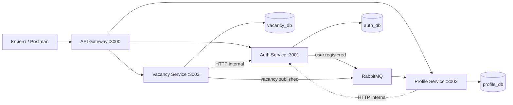

# ДЗ4. Технический дизайн микросервисной архитектуры

**Вариант:** сайт поиска работы  
**Исходное приложение:** монолит ЛР1 (логика перенесена в [`services/`](../services/))  
**Internal API:** [`docs/internal-openapi.yaml`](../docs/internal-openapi.yaml)  
**Срок:** по заданию курса

## Задача

Разделить монолитное backend-приложение на микросервисы по принципу database-per-service. Спроектировать взаимосвязь сервисов, способы их взаимодействия, разделение базы данных, внутренние API для межсервисного обмена (OpenAPI), а также описать форматы запросов, ответов и ошибок.

## Ход работы

### 1. Анализ монолита

Текущий монолит объединяет три предметные области:

| Область | Таблицы | Публичные эндпоинты |
|---------|---------|---------------------|
| Auth | `users`, `refresh_sessions` | `/auth/*`, `GET /me` |
| Profile | `candidate_profiles`, `resumes`, `resume_summaries`, `skills`, `resume_skills` | `/me/profile`, `/me/resumes*` |
| Vacancy | `companies`, `vacancies` | `/vacancies`, `/employer/*` |

Схема резюме нормализована: `resumes` (title, experience_level), `resume_summaries` (1:1), `skills` + `resume_skills` (M:N).

### 2. Разделение на микросервисы

| Сервис | Ответственность | Порт | Путь |
|--------|-----------------|------|------|
| **API Gateway** | единая точка входа, CORS, Swagger | 3000 | `services/gateway/` |
| **Auth Service** | auth, GET /me, internal users API | 3001 | `services/auth/` |
| **Profile Service** | профиль, CRUD резюме, summary, skills | 3002 | `services/profile/` |
| **Vacancy Service** | компании, вакансии, публичный поиск | 3003 | `services/vacancy/` |

### 3. Database-per-service

| База | Таблицы | Сервис |
|------|---------|--------|
| `auth_db` | `users`, `refresh_sessions` | Auth |
| `profile_db` | `candidate_profiles`, `resumes`, `resume_summaries`, `skills`, `resume_skills` | Profile |
| `vacancy_db` | `companies`, `vacancies` | Vacancy |

Поле `user_id` в Profile и `owner_id` в Vacancy — внешние UUID без FK на другую базу. Валидация через internal API Auth Service.

### 4. Способы взаимодействия

**Синхронное (HTTP REST):**

- Gateway → сервисы: публичные запросы;
- Profile/Vacancy → Auth: `GET /internal/users/{id}/validate?role=` с заголовком `X-Service-Token`;
- JWT валидируется общим `ACCESS_TOKEN_SECRET`.

**Асинхронное (RabbitMQ):**

- `user.registered` (Auth → Profile): создание пустого `candidate_profile`;
- `vacancy.published` (Vacancy → future consumers): индексация, уведомления.

Exchange: `vacancies.events` (topic).

### 5. Публичные эндпоинты (через Gateway)

| Метод | Путь | Сервис |
|-------|------|--------|
| POST | `/api/v1/auth/*` | Auth |
| GET | `/api/v1/me` (exact) | Auth |
| PUT/GET/POST/DELETE | `/api/v1/me/*` | Profile |
| GET | `/api/v1/vacancies*` | Vacancy |
| PUT/POST | `/api/v1/employer/*` | Vacancy |

### 6. Internal API

Спецификация: [`docs/internal-openapi.yaml`](../docs/internal-openapi.yaml)

**Auth Service** (`services/auth/src/routes/internal.ts`):

| Метод | Путь | Описание |
|-------|------|----------|
| GET | `/internal/users/{id}` | Получить пользователя |
| GET | `/internal/users/{id}/validate?role=` | Проверить роль |

**Vacancy Service** (`services/vacancy/src/routes/internal.ts`):

| Метод | Путь | Описание |
|-------|------|----------|
| GET | `/internal/companies/{id}` | Данные компании |

### 7. API резюме (Profile Service)

| Метод | Путь | Тело |
|-------|------|------|
| POST | `/api/v1/me/resumes` | `{ title, experience_level }` |
| GET | `/api/v1/me/resumes` | — |
| GET | `/api/v1/me/resumes/{id}` | — |
| PUT | `/api/v1/me/resumes/{id}` | `{ title?, experience_level? }` |
| DELETE | `/api/v1/me/resumes/{id}` | — |
| PUT | `/api/v1/me/resumes/{id}/summary` | `{ content }` |
| DELETE | `/api/v1/me/resumes/{id}/summary` | — |
| GET | `/api/v1/me/resumes/{id}/skills` | — |
| PUT | `/api/v1/me/resumes/{id}/skills` | `{ skills: string[] }` |

Ответ `ResumeDetails`: `{ id, title, experience_level, created_at, updated_at, summary, skills }`.

## Вывод

Подготовлен и реализован технический дизайн микросервисной архитектуры. Монолит разделён на Auth, Profile и Vacancy сервисы с отдельными базами данных, API Gateway и RabbitMQ. Internal API описан в `docs/internal-openapi.yaml`. Публичный API сохранён через Gateway на порту 3000.
