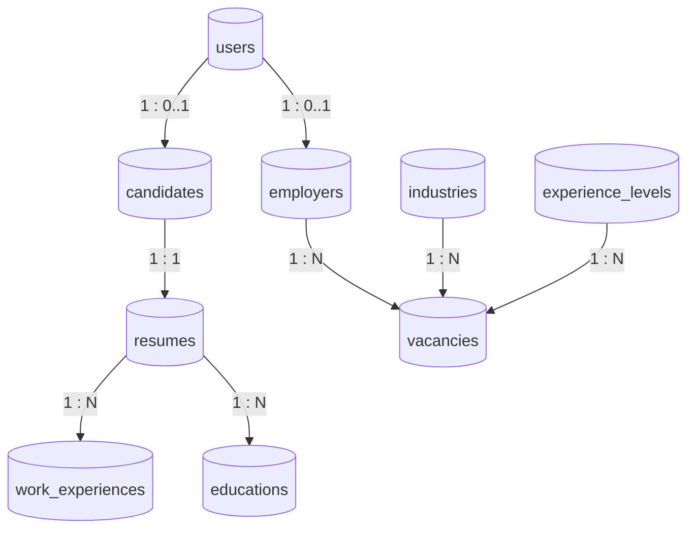

# ERD — Сайт для поиска работы

Нотация: **Crow's Foot** (один-ко-многим, один-к-одному). PK — первичный ключ, FK — внешний ключ, UK — уникальный ключ.


## Диаграмма связей



## Схема связей (текст)

```
users ──1:0..1── candidates ──1:1── resumes ──1:N── work_experiences
  │                              └──1:N── educations
  └──1:0..1── employers ──1:N── vacancies ──N:1── industries
                                    └──N:1── experience_levels
```

## Таблицы и атрибуты

### users

| Колонка | Тип | Ограничения |
|---------|-----|-------------|
| id | uuid | PK |
| email | varchar | UK, NOT NULL |
| password_hash | varchar | NOT NULL |
| role | enum | candidate \| employer |
| created_at | timestamptz | |
| updated_at | timestamptz | |

### candidates

| Колонка | Тип | Ограничения |
|---------|-----|-------------|
| id | uuid | PK |
| user_id | uuid | FK → users.id, UK |
| full_name | varchar | |
| phone | varchar | |
| city | varchar | |
| birth_date | date | NULL |
| created_at | timestamptz | |

### employers

| Колонка | Тип | Ограничения |
|---------|-----|-------------|
| id | uuid | PK |
| user_id | uuid | FK → users.id, UK |
| company_name | varchar | |
| company_description | text | |
| website | varchar | |
| logo_url | varchar | |
| created_at | timestamptz | |

### resumes

| Колонка | Тип | Ограничения |
|---------|-----|-------------|
| id | uuid | PK |
| candidate_id | uuid | FK → candidates.id, UK |
| title | varchar | |
| summary | text | |
| skills | text | |
| updated_at | timestamptz | |

### work_experiences

| Колонка | Тип | Ограничения |
|---------|-----|-------------|
| id | uuid | PK |
| resume_id | uuid | FK → resumes.id |
| company_name | varchar | |
| position | varchar | |
| start_date | date | |
| end_date | date | NULL |
| description | text | |
| sort_order | int | |

### educations

| Колонка | Тип | Ограничения |
|---------|-----|-------------|
| id | uuid | PK |
| resume_id | uuid | FK → resumes.id |
| institution | varchar | |
| degree | varchar | |
| graduation_year | int | |
| sort_order | int | |

### industries

| Колонка | Тип | Ограничения |
|---------|-----|-------------|
| id | uuid | PK |
| name | varchar | UK |
| slug | varchar | UK |

### experience_levels

| Колонка | Тип | Ограничения |
|---------|-----|-------------|
| id | uuid | PK |
| name | varchar | UK |
| slug | varchar | UK |
| min_years | int | |
| max_years | int | NULL |

### vacancies

| Колонка | Тип | Ограничения |
|---------|-----|-------------|
| id | uuid | PK |
| employer_id | uuid | FK → employers.id |
| industry_id | uuid | FK → industries.id |
| experience_level_id | uuid | FK → experience_levels.id |
| title | varchar | |
| description | text | |
| requirements | text | |
| salary_from | int | NULL |
| salary_to | int | NULL |
| salary_currency | varchar | |
| location | varchar | |
| is_published | boolean | |
| created_at | timestamptz | |
| updated_at | timestamptz | |

## Легенда связей

| Связь | Тип | Пояснение |
|-------|-----|-----------|
| `users` → `candidates` | 1 : 0..1 | Один аккаунт — один профиль соискателя (только при `role = candidate`) |
| `users` → `employers` | 1 : 0..1 | Один аккаунт — один профиль работодателя (только при `role = employer`) |
| `candidates` → `resumes` | 1 : 1 | Одно резюме на соискателя (MVP; при необходимости расширяется до 1:N) |
| `resumes` → `work_experiences` | 1 : N | История работы в резюме |
| `resumes` → `educations` | 1 : N | Образование в резюме |
| `employers` → `vacancies` | 1 : N | Работодатель публикует множество вакансий |
| `industries` → `vacancies` | 1 : N | Справочник отраслей для фильтрации |
| `experience_levels` → `vacancies` | 1 : N | Справочник уровня опыта для фильтрации |

