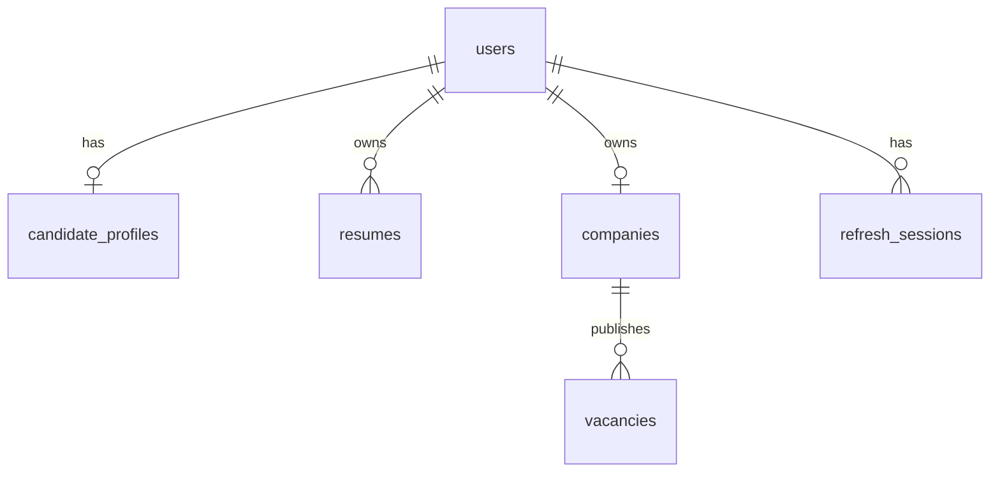

# ДЗ1. Проектирование базы данных

**Вариант:** сайт поиска работы.  
**Стек:** PostgreSQL, TypeORM migrations (`src/migrations/`).  
**Срок:** 01.04.26

## 1. Цель работы

Спроектировать реляционную базу данных для backend-приложения поиска работы: регистрация, профили, резюме, компании, вакансии, авторизация.

## 2. ERD

## 3. Таблицы

- `users` — аккаунты (email UK, password_hash, role)
- `candidate_profiles` — ЛК кандидата (user_id FK UK)
- `resumes` — резюме (user_id FK, skills[])
- `companies` — компания работодателя (owner_id FK UK)
- `vacancies` — вакансии (company_id FK, status, фильтры)
- `refresh_sessions` — refresh-токены (token_hash UK)

## 4. Реализация

- Entities: `src/entities/*.ts`
- Migration: `src/migrations/1730000000000-Init.ts`
- Запуск: `npm run migration:run` (при старте сервера миграции применяются автоматически)

## 5. Вывод

Спроектирована нормализованная схема с PK/FK/UK и индексами под поиск вакансий. ERD и таблицы согласованы с API (ДЗ2).
