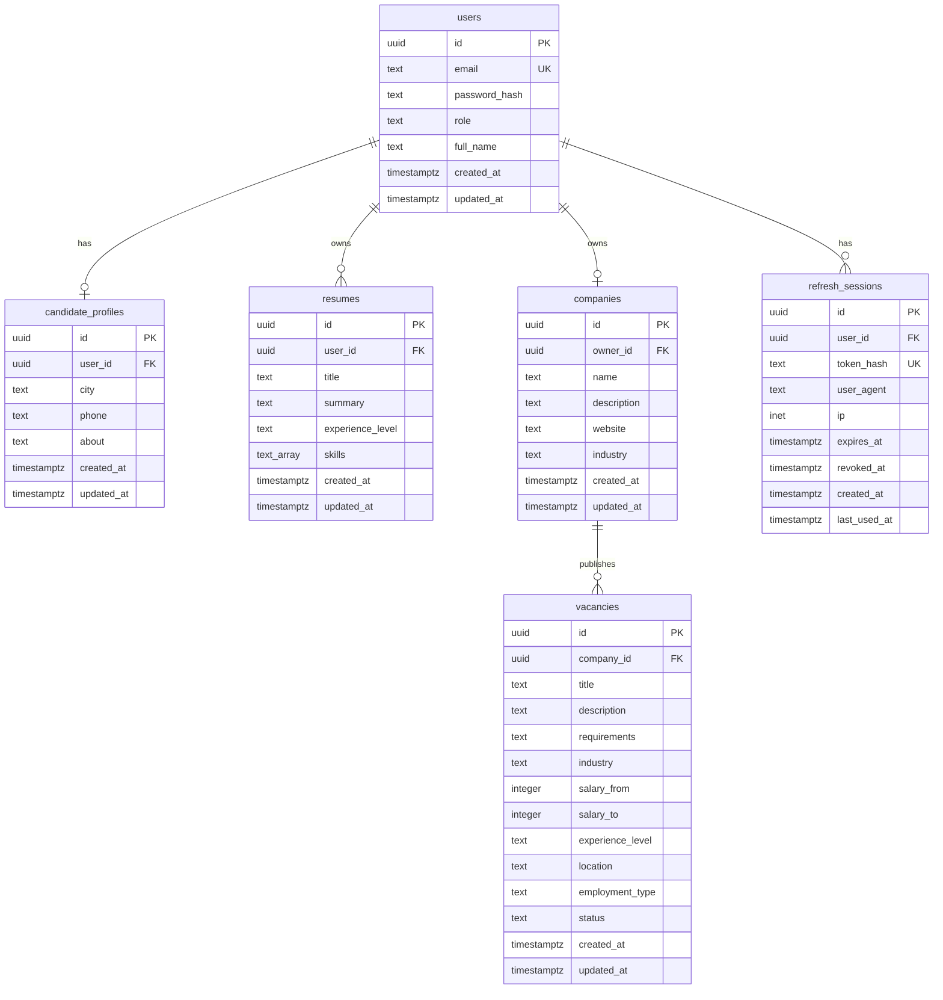

# ДЗ1. Проектирование базы данных

**Вариант:** сайт поиска работы (кандидаты + работодатели).  

## 1. Цель работы

Спроектировать реляционную базу данных для backend-приложения поиска работы: регистрация, профили, резюме, компании, вакансии, авторизация.

## 2. Анализ предметной области

Основные роли:

- **Кандидат** — регистрируется, заполняет профиль, создаёт резюме, ищет вакансии.
- **Работодатель** — регистрируется, создаёт компанию, публикует и управляет вакансиями.

Основные сущности: пользователь, профиль кандидата, резюме, компания, вакансия, сессия авторизации.

## 3. ERD-диаграмма



## 4. Описание таблиц

| Таблица | Назначение | Ключевые поля |
|---------|------------|---------------|
| `users` | Аккаунты | `email` UK, `password_hash`, `role` (`candidate`, `employer`, `admin`) |
| `candidate_profiles` | ЛК кандидата | `user_id` FK UK |
| `resumes` | Резюме | `user_id` FK, `skills[]`, `experience_level` |
| `companies` | Компания работодателя | `owner_id` FK UK |
| `vacancies` | Вакансии | `company_id` FK, фильтры, `status` |
| `refresh_sessions` | Refresh-токены | `token_hash` UK, `expires_at`, `revoked_at` |

Статусы вакансии: `draft`, `published`, `archived`. В публичном поиске — только `published`.

Уровни опыта (`experience_level`): `no_experience`, `junior`, `middle`, `senior`, `lead`.

Тип занятости (`employment_type`): `full_time`, `part_time`, `contract`, `internship`, `remote`.

## 5. Индексы

| Индекс | Таблица | Назначение |
|--------|---------|------------|
| `idx_resumes_user_id` | `resumes` | Список резюме кандидата |
| `idx_vacancies_company_id` | `vacancies` | Вакансии компании |
| `idx_vacancies_public_search` | `vacancies` | Публичный поиск: `status`, `industry`, `experience_level`, `created_at` |
| `idx_vacancies_salary` | `vacancies` | Фильтр по зарплате |
| `idx_refresh_sessions_user_id` | `refresh_sessions` | Сессии пользователя |
| `idx_refresh_sessions_active` | `refresh_sessions` | Активные сессии (partial index) |

## 6. Реализация (Express)

| Артефакт | Путь |
|----------|------|
| Миграция | [`src/migrations/1730000000000-Init.ts`](../src/migrations/1730000000000-Init.ts) |
| Entities (TypeORM) | [`src/entities/`](../src/entities/) |
| Подключение | [`src/data-source.ts`](../src/data-source.ts) |
| Подробное описание (общее с Go) | [`../backend/DB_REPORT.md`](../backend/DB_REPORT.md) |

Запуск миграций:

```bash
docker compose up -d
npm run migration:run
```

При `npm run dev` миграции применяются автоматически в [`src/server.ts`](../src/server.ts).

## 7. Вывод

Спроектирована нормализованная схема с внешними ключами, ограничениями CHECK и индексами под поиск вакансий. ERD и таблицы согласованы с API (ДЗ2). Реализация в Express дублирует схему Go-версии через TypeORM migration и entities.
