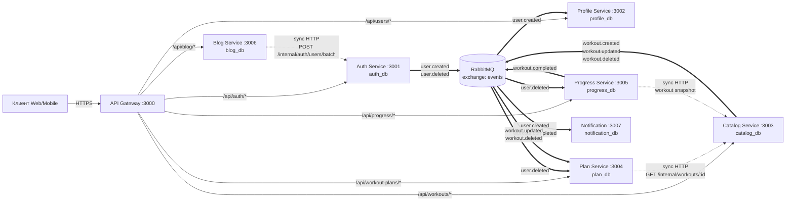
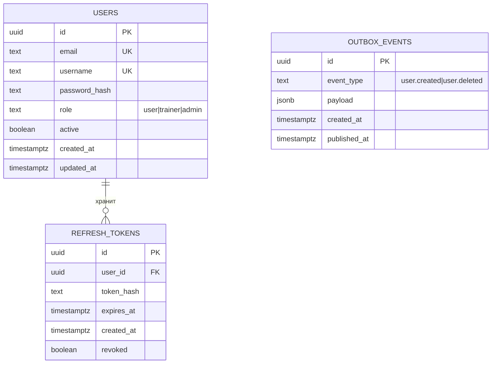
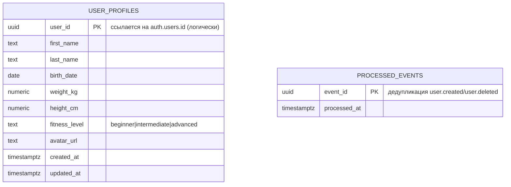
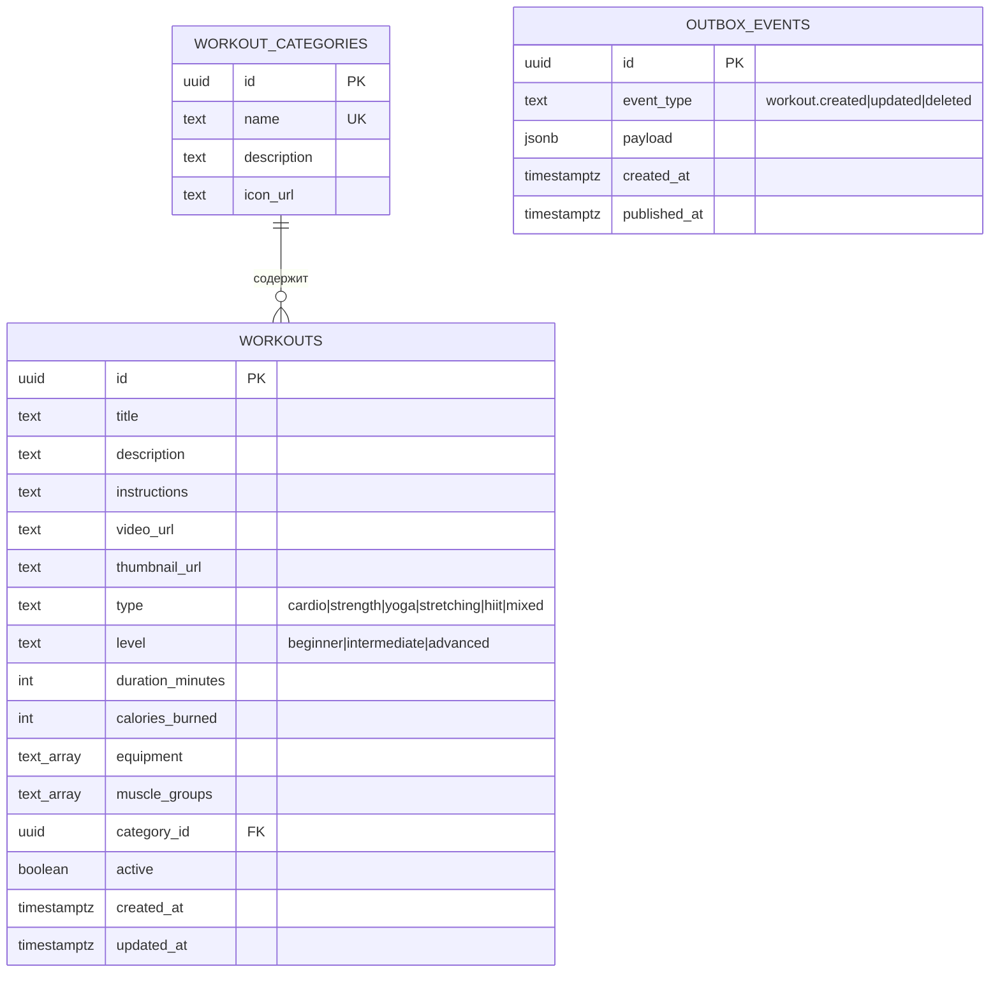
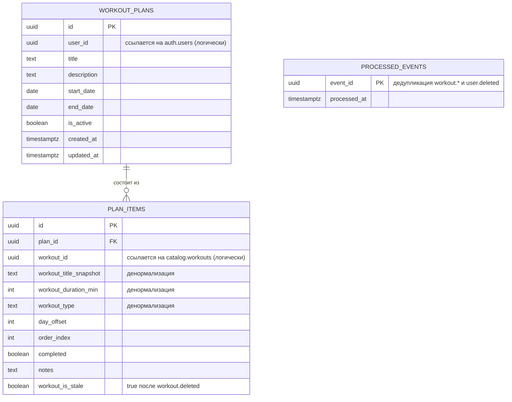
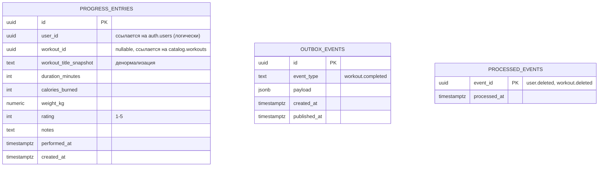
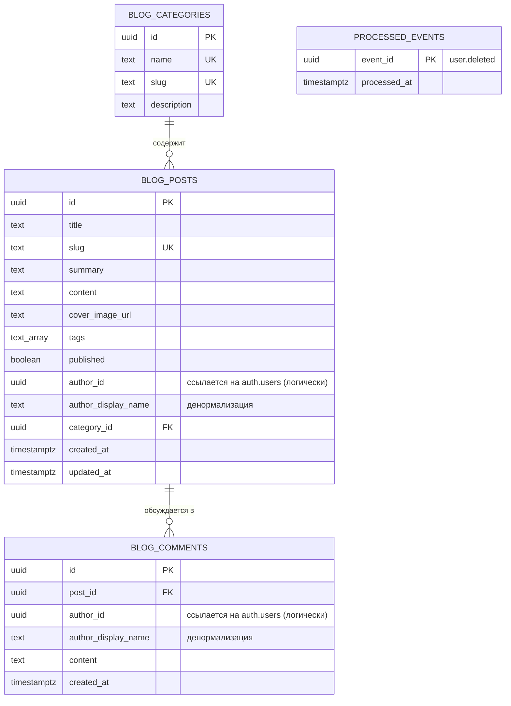
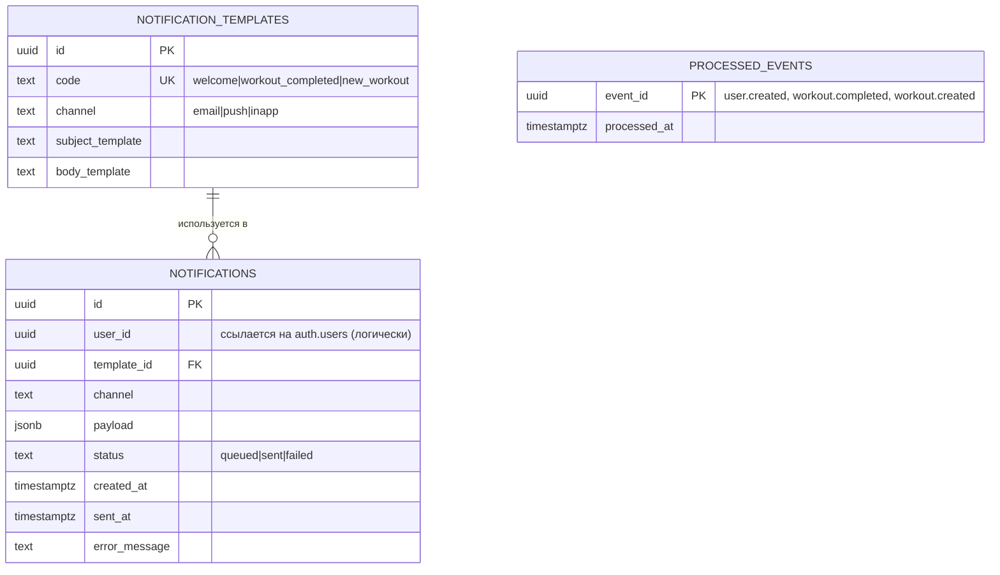
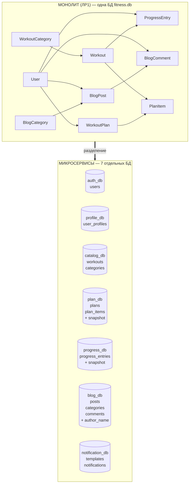

# Схемы баз данных микросервисов

Каждый микросервис владеет собственной PostgreSQL-базой (database-per-service).
Связи между сервисами реализованы **не FK**, а через HTTP API и события RabbitMQ.
Ниже — ER-диаграммы каждой базы и общая карта компонентов системы.

> 💡 **Как открыть диаграммы:**
> - GitHub автоматически рендерит блоки ` ```mermaid `
> - VS Code: расширение **Markdown Preview Mermaid Support** (или открой `.mmd`-файлы)
> - Онлайн: https://mermaid.live — скопируй блок ```mermaid``` и вставь

---

## Общая архитектура (карта сервисов)



**Легенда:**
- сплошная стрелка `→` — внешний HTTP-запрос через Gateway
- пунктир `-.→` — синхронный internal HTTP между сервисами (mTLS + service token)
- толстая стрелка `==>` — асинхронное событие через RabbitMQ

---

## 1. auth_db — Auth Service



---

## 2. profile_db — Profile Service



> Профиль создаётся **автоматически** при получении события `user.created` от auth-service.

---

## 3. catalog_db — Catalog Service



---

## 4. plan_db — Plan Service



> Snapshot-поля (`workout_title_snapshot`, `workout_duration_min`, `workout_type`)
> копируются из catalog в момент добавления тренировки в план. Это позволяет
> показывать план, даже если catalog-service временно недоступен или тренировка
> удалена (`workout_is_stale = true`).

---

## 5. progress_db — Progress Service



---

## 6. blog_db — Blog Service



---

## 7. notification_db — Notification Service



---

## Сравнение: монолит → микросервисы



**Что изменилось:**
- `User` распался на `auth_db.users` (только credentials и role) + `profile_db.user_profiles` (антропометрия)
- FK `plan_items.workout_id → workouts.id` стал **логической ссылкой** + добавились snapshot-поля
- FK `progress_entries.workout_id` стал **nullable** + snapshot
- FK `blog_posts.author_id → users.id` стал **логической ссылкой** + `author_display_name`
