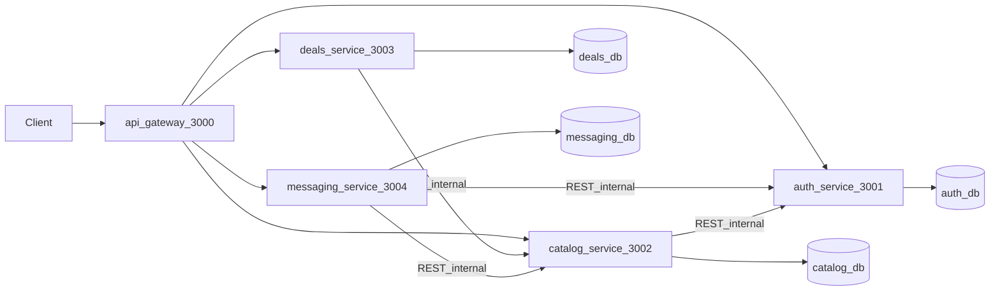
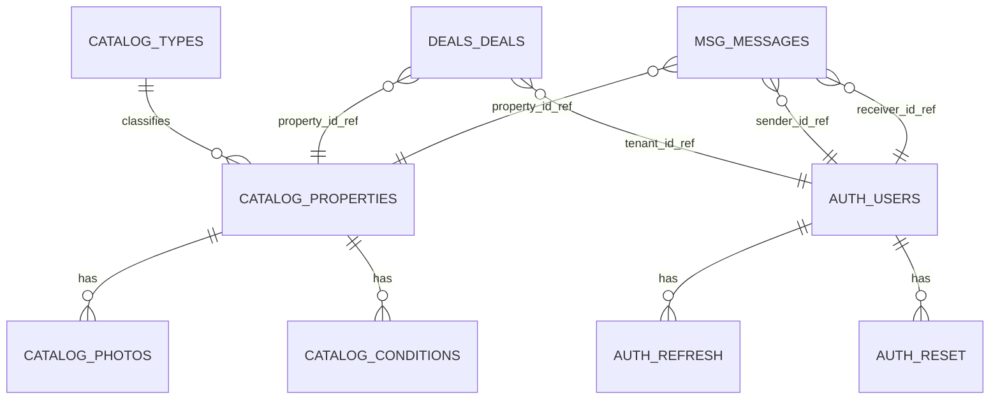

# Диаграммы (ДЗ4)

## Компоненты

```mermaid
flowchart LR
  Client[Client]
  GW[api_gateway_3000]
  Auth[auth_service_3001]
  Cat[catalog_service_3002]
  Deals[deals_service_3003]
  Msg[messaging_service_3004]
  AuthDB[(auth_db)]
  CatDB[(catalog_db)]
  DealsDB[(deals_db)]
  MsgDB[(messaging_db)]

  Client --> GW
  GW --> Auth
  GW --> Cat
  GW --> Deals
  GW --> Msg
  Auth --> AuthDB
  Cat --> CatDB
  Deals --> DealsDB
  Msg --> MsgDB
  Deals -->|REST_internal| Cat
  Msg -->|REST_internal| Auth
  Msg -->|REST_internal| Cat
  Cat -->|REST_internal| Auth
```

## Database-per-service

```mermaid
erDiagram
  AUTH_USERS ||--o{ AUTH_REFRESH : has
  AUTH_USERS ||--o{ AUTH_RESET : has
  CATALOG_TYPES ||--o{ CATALOG_PROPERTIES : classifies
  CATALOG_PROPERTIES ||--o{ CATALOG_PHOTOS : has
  CATALOG_PROPERTIES ||--o{ CATALOG_CONDITIONS : has
  DEALS_DEALS }o--|| CATALOG_PROPERTIES : property_id_ref
  DEALS_DEALS }o--|| AUTH_USERS : tenant_id_ref
  MSG_MESSAGES }o--|| CATALOG_PROPERTIES : property_id_ref
  MSG_MESSAGES }o--|| AUTH_USERS : sender_id_ref
  MSG_MESSAGES }o--|| AUTH_USERS : receiver_id_ref
```

Связи `property_id_ref` / `tenant_id_ref` — только логические UUID, без FK между БД.
