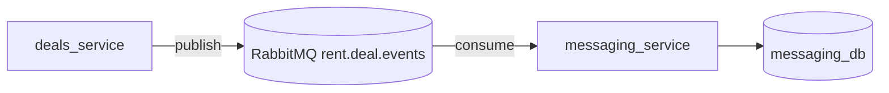

# Очереди (ДЗ5)

```mermaid
flowchart LR
  Deals[deals_service]
  RMQ[(RabbitMQ rent.deal.events)]
  Msg[messaging_service]
  MsgDB[(messaging_db)]

  Deals -->|publish| RMQ
  RMQ -->|consume| Msg
  Msg --> MsgDB
```

HTTP internal (auth, catalog) — без изменений, см. ДЗ4.
