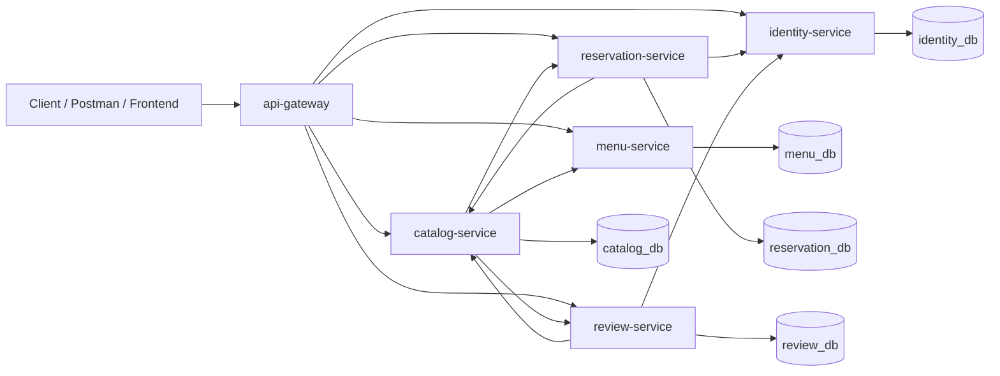
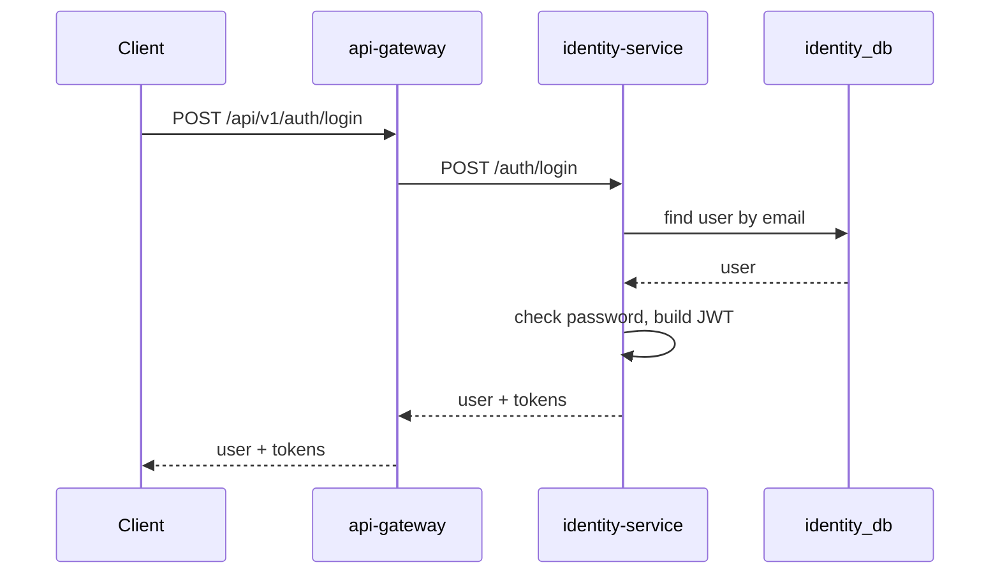
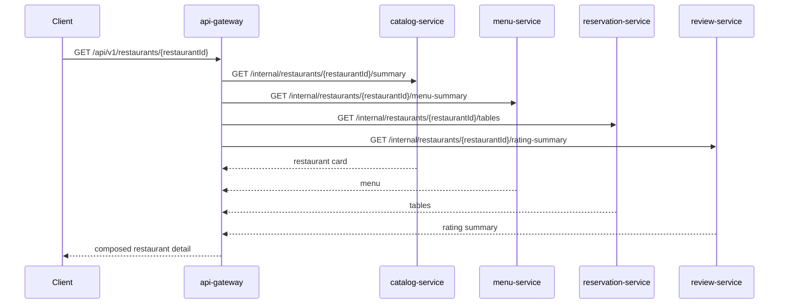
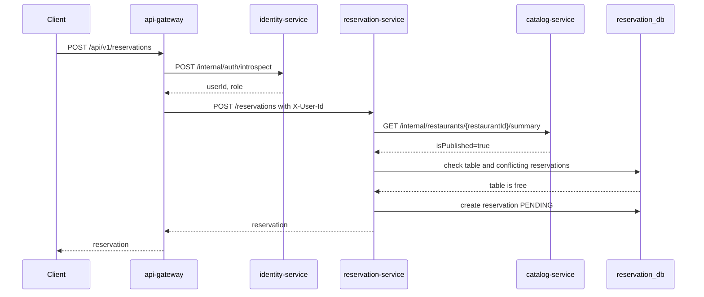
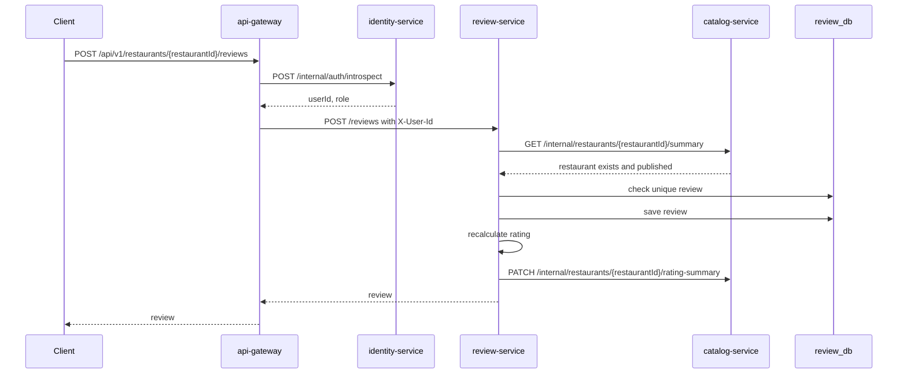

# Домашняя работа №4

## Технический дизайн микросервисной архитектуры сервиса бронирования ресторанов

**Студент:** Ермаков Максим Олегович  
**Группа:** K3340  
**Предметная область:** приложение для поиска ресторанов и бронирования столиков

## 1. Цель работы

Цель работы — спроектировать переход текущего монолитного backend-приложения на
микросервисную архитектуру с соблюдением подхода `database-per-service`.

В рамках проекта необходимо:

1. Разделить монолит на микросервисы по границам предметной области.
2. Описать взаимодействие микросервисов друг с другом.
3. Разнести единую БД на независимые БД сервисов.
4. Спроектировать внутренние REST-эндпоинты в формате OpenAPI.
5. Описать запросы, ответы, ошибки и шаги миграции от монолита к микросервисам.

## 2. Исходное состояние монолита

Текущий монолит реализован на `Node.js`, `Express`, `routing-controllers`,
`TypeORM` и `PostgreSQL`. Он покрывает функциональность из предыдущих работ:

- регистрация, вход и JWT-авторизация;
- профиль пользователя;
- справочники кухонь, локаций, ролей, ценовых категорий и статусов;
- поиск ресторанов с фильтрацией;
- карточка ресторана с локацией, кухнями, меню, фотографиями, отзывами и столиками;
- проверка доступности столиков;
- создание, изменение, отмена и просмотр бронирований;
- создание и изменение отзывов;
- административное управление ресторанами, локациями, столиками, меню, фото и статусами бронирований.

В единой БД монолита используются следующие сущности:

- `users`;
- `locations`;
- `cuisines`;
- `restaurants`;
- `restaurant_photos`;
- `restaurant_tables`;
- `menu_categories`;
- `menu_items`;
- `reviews`;
- `reservations`;
- таблица связи `restaurant_cuisines`.

Основная проблема монолита для дальнейшего развития: разные предметные области
жёстко связаны общей БД и общей кодовой базой. Например, создание бронирования
одновременно зависит от пользователей, ресторанов, столиков и статусов
бронирования; изменение отзыва пересчитывает рейтинг ресторана напрямую через
таблицы монолита.

## 3. Предлагаемая микросервисная архитектура

### 3.1 Состав сервисов

| Компонент | Ответственность | Внешняя БД |
|---|---|---|
| `api-gateway` | Единая публичная точка входа, проверка авторизации, маршрутизация, композиция сложных ответов | Нет |
| `identity-service` | Пользователи, роли, регистрация, вход, выпуск и проверка JWT | `identity_db` |
| `catalog-service` | Рестораны, локации, кухни, фотографии, публикация ресторанов | `catalog_db` |
| `menu-service` | Категории меню и позиции меню ресторанов | `menu_db` |
| `reservation-service` | Столики, доступность, создание и жизненный цикл бронирований | `reservation_db` |
| `review-service` | Отзывы пользователей, проверка уникальности отзыва, расчёт рейтинга | `review_db` |

`api-gateway` не владеет данными и не имеет собственной БД. Его задача —
сохранить публичный REST API, спроектированный в ДЗ2 и реализованный в ЛР1, а
внутри направлять запросы к нужным сервисам.

### 3.2 Диаграмма контейнеров



### 3.3 Принципы взаимодействия

1. Публичные клиенты обращаются только к `api-gateway`.
2. Сервисы не ходят напрямую в чужие БД.
3. Каждый сервис хранит только свои агрегаты и внешние идентификаторы.
4. Валидация существования внешнего агрегата выполняется через внутренний REST API
   сервиса-владельца.
5. Для операций, которым нужна немедленная консистентность, используются
   синхронные HTTP-вызовы.
6. Для будущей ЛР/ДЗ по очередям событийные сценарии можно перевести на
   RabbitMQ/Kafka без изменения границ сервисов.

## 4. Границы микросервисов

### 4.1 API Gateway

`api-gateway` сохраняет внешний контракт `/api/v1/*`:

- `/api/v1/auth/*` проксируется в `identity-service`;
- `/api/v1/users/*` проксируется в `identity-service`;
- `/api/v1/reference/*` агрегирует данные `catalog-service` и локальные enum-значения;
- `/api/v1/restaurants/*` частично проксируется в `catalog-service`, частично
  собирается из `catalog-service`, `menu-service`, `reservation-service` и `review-service`;
- `/api/v1/reservations/*` проксируется в `reservation-service`;
- `/api/v1/admin/*` маршрутизируется в сервис-владелец нужного агрегата.

Gateway выполняет:

- проверку заголовка `Authorization`;
- вызов `identity-service /internal/auth/introspect`;
- передачу `X-User-Id`, `X-User-Role`, `X-Request-Id` во внутренние сервисы;
- композицию детальной карточки ресторана;
- нормализацию ошибок в единый формат.

### 4.2 Identity Service

Сервис владеет пользователями и авторизацией.

Публичные операции через gateway:

- регистрация;
- вход;
- выход;
- получение профиля;
- обновление профиля.

Внутренние операции:

- проверка JWT и возврат текущего пользователя;
- получение краткого профиля пользователя по `userId`;
- пакетное получение кратких профилей для списков отзывов и бронирований.

### 4.3 Catalog Service

Сервис владеет каталогом ресторанов и справочниками, которые описывают ресторан:

- локации;
- кухни;
- рестораны;
- связь ресторанов и кухонь;
- фотографии;
- статус публикации;
- денормализованное поле рейтинга для быстрого поиска.

Catalog не хранит меню, отзывы, бронирования и пользователей.

### 4.4 Menu Service

Сервис владеет меню ресторанов:

- категории меню;
- позиции меню;
- цена, вес, доступность блюда.

В таблицах `menu_db` хранится `restaurant_id`, но это не внешний ключ в БД.
Перед созданием категории меню сервис проверяет ресторан через
`catalog-service`.

### 4.5 Reservation Service

Сервис владеет бронированиями и столиками:

- физические столики ресторанов;
- активность и вместимость столиков;
- бронирования;
- статусы бронирований;
- проверка занятости стола на дату и время.

`reservation-service` хранит `user_id` и `restaurant_id` как внешние
идентификаторы. Перед созданием бронирования сервис проверяет:

- пользователя через `identity-service`;
- публикацию ресторана через `catalog-service`;
- наличие активного столика в собственной БД;
- отсутствие конфликтующего бронирования.

### 4.6 Review Service

Сервис владеет отзывами:

- отзыв пользователя на ресторан;
- ограничение "один отзыв пользователя на ресторан";
- расчёт среднего рейтинга и количества отзывов.

После создания или изменения отзыва сервис может синхронно вызвать
`catalog-service /internal/restaurants/{restaurantId}/rating-summary` для
обновления денормализованного рейтинга либо в будущем отправить событие
`RestaurantRatingChanged`.

## 5. Разделение базы данных

В микросервисной архитектуре каждая БД принадлежит ровно одному сервису.
Сервисы не создают внешние ключи на таблицы чужих БД: вместо этого они хранят
идентификаторы внешних агрегатов (`user_id`, `restaurant_id`) и проверяют их
через внутренние REST-эндпоинты сервисов-владельцев.

### 5.1 identity_db

| Таблица | Назначение |
|---|---|
| `users` | Пользователи, роли, контакты, хэш пароля, признак верификации |
| `refresh_sessions` | Опциональная таблица refresh-сессий для развития logout/refresh-token |

#### Таблица `users`

| Поле | Тип | Описание |
|---|---|---|
| `id` | `uuid` | Уникальный идентификатор пользователя |
| `role` | `varchar(20)` / enum `ADMIN`, `USER` | Роль пользователя в системе |
| `first_name` | `varchar(100)` | Имя пользователя |
| `last_name` | `varchar(100)` | Фамилия пользователя |
| `email` | `varchar(255)` | Email для входа, уникальное поле |
| `phone` | `varchar(30)` | Телефон пользователя, уникальное поле |
| `password_hash` | `varchar(255)` | Хэш пароля; исходный пароль не хранится |
| `is_verified` | `boolean` | Признак подтверждения учетной записи |
| `created_at` | `timestamp` | Дата и время создания записи |
| `updated_at` | `timestamp` | Дата и время последнего обновления записи |

#### Таблица `refresh_sessions`

| Поле | Тип | Описание |
|---|---|---|
| `id` | `uuid` | Уникальный идентификатор refresh-сессии |
| `user_id` | `uuid` | Идентификатор пользователя внутри `identity_db` |
| `refresh_token_hash` | `varchar(255)` | Хэш refresh-токена |
| `expires_at` | `timestamp` | Дата и время истечения сессии |
| `revoked_at` | `timestamp nullable` | Дата отзыва сессии при logout или компрометации |
| `created_at` | `timestamp` | Дата и время создания записи |
| `updated_at` | `timestamp` | Дата и время последнего обновления записи |

### 5.2 catalog_db

| Таблица | Назначение |
|---|---|
| `locations` | Город, адрес, район, метро |
| `cuisines` | Справочник кухонь |
| `restaurants` | Основная карточка ресторана |
| `restaurant_cuisines` | Связь ресторанов и кухонь |
| `restaurant_photos` | Фотографии ресторана |

#### Таблица `locations`

| Поле | Тип | Описание |
|---|---|---|
| `id` | `uuid` | Уникальный идентификатор локации |
| `city` | `varchar(100)` | Город, в котором находится ресторан |
| `address` | `varchar(255)` | Адрес ресторана |
| `district` | `varchar(100) nullable` | Район города |
| `metro_station` | `varchar(100) nullable` | Ближайшая станция метро |
| `created_at` | `timestamp` | Дата и время создания записи |
| `updated_at` | `timestamp` | Дата и время последнего обновления записи |

#### Таблица `cuisines`

| Поле | Тип | Описание |
|---|---|---|
| `id` | `uuid` | Уникальный идентификатор кухни |
| `title` | `varchar(100)` | Название кухни, например `Итальянская` или `Японская` |
| `created_at` | `timestamp` | Дата и время создания записи |
| `updated_at` | `timestamp` | Дата и время последнего обновления записи |

#### Таблица `restaurants`

| Поле | Тип | Описание |
|---|---|---|
| `id` | `uuid` | Уникальный идентификатор ресторана |
| `location_id` | `uuid` | Идентификатор локации внутри `catalog_db` |
| `title` | `varchar(150)` | Название ресторана |
| `description` | `text nullable` | Текстовое описание ресторана |
| `phone` | `varchar(30)` | Контактный телефон ресторана |
| `email` | `varchar(255) nullable` | Контактный email ресторана |
| `open_time` | `varchar(5)` | Время открытия в формате `HH:mm` |
| `close_time` | `varchar(5)` | Время закрытия в формате `HH:mm` |
| `price_category` | `varchar(20)` / enum `LOW`, `MEDIUM`, `HIGH` | Ценовая категория ресторана |
| `avg_rating` | `float` | Денормализованный средний рейтинг из `review-service` |
| `reviews_count` | `integer` | Денормализованное количество отзывов из `review-service` |
| `is_published` | `boolean` | Признак доступности ресторана в публичном каталоге |
| `created_at` | `timestamp` | Дата и время создания записи |
| `updated_at` | `timestamp` | Дата и время последнего обновления записи |

#### Таблица `restaurant_cuisines`

| Поле | Тип | Описание |
|---|---|---|
| `restaurant_id` | `uuid` | Идентификатор ресторана внутри `catalog_db` |
| `cuisine_id` | `uuid` | Идентификатор кухни внутри `catalog_db` |
| `created_at` | `timestamp` | Дата и время создания связи |

#### Таблица `restaurant_photos`

| Поле | Тип | Описание |
|---|---|---|
| `id` | `uuid` | Уникальный идентификатор фотографии |
| `restaurant_id` | `uuid` | Идентификатор ресторана внутри `catalog_db` |
| `image_url` | `varchar(500)` | URL изображения ресторана |
| `is_main` | `boolean` | Признак главной фотографии ресторана |
| `created_at` | `timestamp` | Дата и время создания записи |
| `updated_at` | `timestamp` | Дата и время последнего обновления записи |

`avg_rating` и `reviews_count` являются проекцией данных из `review-service`.
Источник истины для отзывов остаётся в `review_db`.

### 5.3 menu_db

| Таблица | Назначение |
|---|---|
| `menu_categories` | Категории меню ресторана |
| `menu_items` | Позиции меню |

#### Таблица `menu_categories`

| Поле | Тип | Описание |
|---|---|---|
| `id` | `uuid` | Уникальный идентификатор категории меню |
| `restaurant_id` | `uuid` | Идентификатор ресторана из `catalog-service`; внешнего ключа в БД нет |
| `title` | `varchar(120)` | Название категории меню |
| `created_at` | `timestamp` | Дата и время создания записи |
| `updated_at` | `timestamp` | Дата и время последнего обновления записи |

#### Таблица `menu_items`

| Поле | Тип | Описание |
|---|---|---|
| `id` | `uuid` | Уникальный идентификатор позиции меню |
| `menu_category_id` | `uuid` | Идентификатор категории меню внутри `menu_db` |
| `title` | `varchar(150)` | Название блюда или напитка |
| `description` | `text nullable` | Описание позиции меню |
| `price` | `numeric(10,2)` | Цена позиции меню |
| `weight` | `varchar(50) nullable` | Вес или объём, например `250 г` или `0.3 л` |
| `is_available` | `boolean` | Признак доступности позиции для заказа |
| `created_at` | `timestamp` | Дата и время создания записи |
| `updated_at` | `timestamp` | Дата и время последнего обновления записи |

### 5.4 reservation_db

| Таблица | Назначение |
|---|---|
| `restaurant_tables` | Столики ресторанов |
| `reservations` | Бронирования |

#### Таблица `restaurant_tables`

| Поле | Тип | Описание |
|---|---|---|
| `id` | `uuid` | Уникальный идентификатор столика |
| `restaurant_id` | `uuid` | Идентификатор ресторана из `catalog-service`; внешнего ключа в БД нет |
| `table_number` | `varchar(20)` | Номер или код столика внутри ресторана |
| `capacity` | `integer` | Максимальное количество гостей за столиком |
| `is_active` | `boolean` | Признак доступности столика для бронирования |
| `created_at` | `timestamp` | Дата и время создания записи |
| `updated_at` | `timestamp` | Дата и время последнего обновления записи |

#### Таблица `reservations`

| Поле | Тип | Описание |
|---|---|---|
| `id` | `uuid` | Уникальный идентификатор бронирования |
| `user_id` | `uuid` | Идентификатор пользователя из `identity-service`; внешнего ключа в БД нет |
| `restaurant_id` | `uuid` | Идентификатор ресторана из `catalog-service`; внешнего ключа в БД нет |
| `table_id` | `uuid` | Идентификатор столика внутри `reservation_db` |
| `status` | `varchar(20)` / enum `PENDING`, `CONFIRMED`, `CANCELLED`, `COMPLETED` | Текущий статус бронирования |
| `reservation_date` | `date` | Дата бронирования |
| `reservation_time` | `time` | Время бронирования |
| `guests_count` | `integer` | Количество гостей |
| `comment` | `text nullable` | Комментарий пользователя к бронированию |
| `cancel_reason` | `text nullable` | Причина отмены бронирования |
| `created_at` | `timestamp` | Дата и время создания записи |
| `updated_at` | `timestamp` | Дата и время последнего обновления записи |

Ограничение уникальности для активных бронирований:

- `table_id`;
- `reservation_date`;
- `reservation_time`;
- статусы `PENDING`, `CONFIRMED`, `COMPLETED`.

### 5.5 review_db

| Таблица | Назначение |
|---|---|
| `reviews` | Отзывы пользователей |
| `restaurant_rating_snapshots` | Опциональная таблица агрегатов рейтинга |

#### Таблица `reviews`

| Поле | Тип | Описание |
|---|---|---|
| `id` | `uuid` | Уникальный идентификатор отзыва |
| `restaurant_id` | `uuid` | Идентификатор ресторана из `catalog-service`; внешнего ключа в БД нет |
| `user_id` | `uuid` | Идентификатор пользователя из `identity-service`; внешнего ключа в БД нет |
| `rating` | `numeric(2,1)` | Оценка ресторана от 1 до 5 |
| `comment` | `text` | Текст отзыва |
| `created_at` | `timestamp` | Дата и время создания записи |
| `updated_at` | `timestamp` | Дата и время последнего обновления записи |

#### Таблица `restaurant_rating_snapshots`

| Поле | Тип | Описание |
|---|---|---|
| `restaurant_id` | `uuid` | Идентификатор ресторана из `catalog-service`; внешний ключ не создаётся |
| `avg_rating` | `numeric(2,1)` | Средний рейтинг ресторана по отзывам |
| `reviews_count` | `integer` | Количество отзывов ресторана |
| `recalculated_at` | `timestamp` | Дата и время последнего пересчёта агрегата |

Уникальный индекс:

- `restaurant_id`;
- `user_id`.

## 6. Внутренние REST-контракты

Полная OpenAPI 3.1-спецификация внутренних методов находится в файле
`internal-openapi.yaml`.

Основные внутренние методы:

| Сервис | Метод | Назначение |
|---|---|---|
| `identity-service` | `POST /internal/auth/introspect` | Проверить JWT и вернуть пользователя |
| `identity-service` | `GET /internal/users/{userId}/summary` | Получить краткий профиль пользователя |
| `identity-service` | `POST /internal/users/summaries` | Получить краткие профили пачкой |
| `catalog-service` | `GET /internal/restaurants/{restaurantId}/summary` | Проверить ресторан и получить краткое описание |
| `catalog-service` | `POST /internal/restaurants/summaries` | Получить карточки ресторанов пачкой |
| `catalog-service` | `PATCH /internal/restaurants/{restaurantId}/rating-summary` | Обновить проекцию рейтинга |
| `menu-service` | `GET /internal/restaurants/{restaurantId}/menu-summary` | Получить меню ресторана |
| `reservation-service` | `GET /internal/restaurants/{restaurantId}/tables/available` | Получить доступные столики |
| `reservation-service` | `POST /internal/availability/search` | Проверить доступность по списку ресторанов |
| `reservation-service` | `GET /internal/reservations/{reservationId}/summary` | Получить краткую информацию о бронировании |
| `review-service` | `GET /internal/restaurants/{restaurantId}/rating-summary` | Получить рейтинг ресторана |
| `review-service` | `GET /internal/restaurants/{restaurantId}/reviews-summary` | Получить отзывы ресторана с пагинацией |

## 7. Основные сценарии взаимодействия

### 7.1 Вход пользователя



### 7.2 Получение детальной карточки ресторана



### 7.3 Создание бронирования



### 7.4 Создание отзыва



## 8. Формат ошибок

Все сервисы возвращают единый формат ошибки:

```json
{
  "error": {
    "code": "RESTAURANT_NOT_FOUND",
    "message": "Restaurant is not found",
    "details": []
  }
}
```

Стандартные HTTP-коды:

| Код | Когда используется |
|---|---|
| `400 Bad Request` | Неверный формат запроса |
| `401 Unauthorized` | Нет или невалидный токен |
| `403 Forbidden` | Недостаточно прав |
| `404 Not Found` | Сущность не найдена |
| `409 Conflict` | Бизнес-конфликт, например занятый столик |
| `422 Validation Error` | Ошибка валидации данных |
| `500 Internal Server Error` | Непредвиденная ошибка сервиса |
| `502 Bad Gateway` | Gateway не смог получить корректный ответ от сервиса |
| `503 Service Unavailable` | Внутренний сервис временно недоступен |

## 9. Консистентность данных

В микросервисной архитектуре нельзя использовать прямые транзакции между всеми
БД. Поэтому проект использует следующие правила:

1. Сильная консистентность сохраняется внутри одного сервиса и одной БД.
2. Перед созданием сущности с внешними ссылками сервис синхронно проверяет
   существование внешних агрегатов.
3. Денормализованные данные считаются проекциями и могут быть пересчитаны.
4. Для будущего развития добавляется паттерн outbox и события:
   - `RestaurantPublished`;
   - `RestaurantUpdated`;
   - `TableChanged`;
   - `ReservationCreated`;
   - `ReservationStatusChanged`;
   - `ReservationCancelled`;
   - `ReviewCreated`;
   - `ReviewUpdated`;
   - `RestaurantRatingChanged`.

В рамках ДЗ4 основное взаимодействие описано через REST. В рамках ДЗ5 часть
сценариев логично перевести на RabbitMQ/Kafka.

## 10. План перехода от монолита к микросервисам

### Шаг 1. Подготовить общие контракты

- Вынести общий формат ошибки.
- Вынести DTO для внутренних REST-контрактов.
- Добавить `X-Request-Id` для трассировки.
- Зафиксировать OpenAPI для внутренних методов.

### Шаг 2. Выделить `identity-service`

- Перенести `users`, регистрацию, вход, профиль и проверку JWT.
- Оставить в других сервисах только `user_id`.
- Подключить gateway к `POST /internal/auth/introspect`.

### Шаг 3. Выделить `catalog-service`

- Перенести `locations`, `cuisines`, `restaurants`, `restaurant_photos`,
  `restaurant_cuisines`.
- Реализовать внутренний метод получения краткой карточки ресторана.
- Убрать прямые чтения ресторана из бронирований, меню и отзывов.

### Шаг 4. Выделить `menu-service`

- Перенести `menu_categories` и `menu_items`.
- Проверять ресторан через `catalog-service`.
- Gateway собирает меню ресторана из `menu-service`.

### Шаг 5. Выделить `reservation-service`

- Перенести `restaurant_tables` и `reservations`.
- Проверять пользователя и ресторан через внутренние методы.
- Реализовать проверку доступности столиков.

### Шаг 6. Выделить `review-service`

- Перенести `reviews`.
- Проверять пользователя и ресторан через внутренние методы.
- Реализовать пересчёт рейтинга.
- Обновлять рейтинг в `catalog-service` через внутренний REST-вызов или событие.

### Шаг 7. Обновить публичный API и тесты

- Сохранить внешний контракт `/api/v1`.
- Переписать Postman-сценарий так, чтобы он проходил через gateway.
- Добавить интеграционные тесты для основных межсервисных сценариев.

### Шаг 8. Подготовить развитие для следующих работ

- Для ЛР2 реализовать отдельные процессы сервисов.
- Для ДЗ5 подключить брокер сообщений.
- Для ЛР3 добавить Dockerfile для каждого сервиса и общий `docker-compose.yml`.
- Для ДЗ6 подготовить CI/CD и автодеплой.

## 11. Требования к реализации микросервисов

### 11.1 Технические требования

- Каждый сервис запускается отдельным Node.js-процессом.
- Каждый сервис имеет отдельную PostgreSQL-БД.
- Сервисы не используют общие TypeORM-сущности.
- Для каждого сервиса публикуется собственная OpenAPI-документация.
- Gateway имеет настройки адресов внутренних сервисов через env-переменные.
- Внутренние вызовы должны иметь timeout и обработку недоступности сервиса.

### 11.2 Требования к безопасности

- Публичные запросы принимаются только gateway.
- Внутренние endpoints недоступны извне инфраструктурной сети.
- Gateway передаёт во внутренние сервисы только проверенные данные пользователя.
- Административные операции проверяют роль `ADMIN`.
- Пароли остаются только в `identity_db` и не возвращаются ни одним API.

### 11.3 Требования к наблюдаемости

- Все сервисы логируют `X-Request-Id`.
- Ошибки внутренних вызовов логируются с именем сервиса-источника и сервиса-получателя.
- Для каждого сервиса должен быть endpoint `/health`.
- В будущем можно добавить метрики по latency и error rate.

## 12. Вывод

Предложенная архитектура разделяет монолит по устойчивым границам предметной
области: пользователи, каталог, меню, бронирования и отзывы. Каждый сервис
владеет собственной БД, а межсервисные зависимости выражены через внутренние
REST-контракты. Такой дизайн сохраняет текущий публичный API приложения, но
позволяет развивать доменные части независимо, масштабировать нагруженные
сервисы отдельно и подготовиться к последующим заданиям по очередям сообщений,
контейнеризации и CI/CD.
