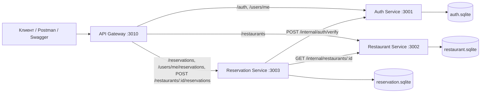

# ДЗ4: Технический дизайн микросервисной архитектуры

## 1. Цель

Разделить монолитное приложение бронирования столиков в ресторанах на независимые микросервисы с принципом **database-per-service** и синхронным REST-взаимодействием между сервисами.

Исходный монолит: TypeScript + Express + Sequelize + SQLite (`src/`).

---

## 2. Декомпозиция монолита

| Микросервис | Ответственность | Порт |
|---|---|---|
| **API Gateway** | Единая точка входа, маршрутизация, Swagger UI | 3010 |
| **Auth Service** | Регистрация, вход, JWT, профиль пользователя | 3001 |
| **Restaurant Service** | Рестораны, меню, фото, отзывы, поиск/фильтры | 3002 |
| **Reservation Service** | Создание и история бронирований | 3003 |

### Обоснование границ

- **Auth** — отдельный домен идентичности: пользователи и токены не должны зависеть от ресторанов/броней.
- **Restaurant** — каталог и контент (меню, фото, отзывы), высокая читаемость, редкие изменения структуры.
- **Reservation** — транзакционный домен бронирований; при создании брони нужны данные из Auth и Restaurant, но хранит только свои записи.
- **Gateway** — скрывает от клиента топологию микросервисов, сохраняет прежние URL.

---

## 3. Схема взаимодействия



**Тип взаимодействия:** синхронный HTTP/REST.

**Безопасность internal API:** заголовок `X-Service-Key` (общий секрет `SERVICE_KEY` для доверенных сервисов).

**JWT:** выдаётся Auth Service; Reservation Service проверяет токен через internal endpoint Auth (не напрямую в своей БД).

---

## 4. Database-per-service

### 4.1 Auth DB — `services/data/auth.sqlite`

| Таблица | Поля |
|---|---|
| `Users` | id, name, email, password_hash, role |

Только данные пользователей. Никаких FK на рестораны или брони.

### 4.2 Restaurant DB — `services/data/restaurant.sqlite`

| Таблица | Поля / связи |
|---|---|
| `Restaurants` | id, name, cuisine, city, address, average_check, description |
| `MenuItems` | id, name, price, RestaurantId (FK внутри restaurant DB) |
| `RestaurantPhotos` | id, url, RestaurantId |
| `Reviews` | id, UserId, author_name, rating, text, RestaurantId |

**Важно:** `Reviews.UserId` — внешний идентификатор из Auth Service (без FK). Поле `author_name` денормализовано при записи отзыва, чтобы не делать JOIN с Auth DB при чтении.

### 4.3 Reservation DB — `services/data/reservation.sqlite`

| Таблица | Поля |
|---|---|
| `Reservations` | id, UserId, RestaurantId, guests_count, reservation_datetime, status, restaurant_name, restaurant_city, restaurant_cuisine, restaurant_average_check |

**Важно:**
- `UserId` и `RestaurantId` — логические ссылки, без FK между БД.
- Поля `restaurant_*` — snapshot ресторана на момент бронирования (денормализация для истории без cross-DB JOIN).

### 4.4 Сравнение с монолитом

| Было (монолит) | Стало (микросервисы) |
|---|---|
| Одна `database.sqlite` | Три файла SQLite |
| JOIN User ↔ Review | `author_name` в Review |
| JOIN Restaurant ↔ Reservation | snapshot в Reservation |
| Один процесс Express | Четыре процесса + Gateway |

---

## 5. Публичные эндпоинты (через API Gateway)

Клиент обращается только к Gateway (`http://localhost:3010`). Маршрутизация:

| Публичный путь | Метод | Целевой сервис |
|---|---|---|
| `/auth/register` | POST | Auth |
| `/auth/login` | POST | Auth |
| `/users/me` | GET | Auth |
| `/restaurants` | GET | Restaurant |
| `/restaurants/{id}` | GET | Restaurant |
| `/restaurants/{id}/reservations` | POST | Reservation |
| `/reservations` | POST, GET | Reservation |
| `/users/me/reservations` | GET | Reservation |

Полная спецификация публичного API: `docs/openapi.yaml` (как в монолите, для совместимости с Postman и Swagger).

---

## 6. Межсервисные эндпоинты (internal)

Полная OpenAPI-спецификация: **`docs/openapi-inter-service.yaml`**.

### 6.1 Auth Service (порт 3001)

#### `GET /internal/users/{id}`

Получение пользователя по ID (для обогащения данных в других сервисах).

**Заголовки:** `X-Service-Key: <SERVICE_KEY>`

**Ответ 200:**
```json
{
  "id": 1,
  "name": "Demo User",
  "email": "demo@example.com",
  "role": "user"
}
```

**Ошибки:** `403` (неверный key), `404` (пользователь не найден).

---

#### `POST /internal/auth/verify`

Проверка JWT и возврат профиля пользователя.

**Тело запроса:**
```json
{
  "token": "eyJhbGciOiJIUzI1NiIsInR5cCI6IkpXVCJ9..."
}
```

**Ответ 200:**
```json
{
  "valid": true,
  "user": {
    "id": 1,
    "name": "Demo User",
    "email": "demo@example.com",
    "role": "user"
  }
}
```

**Ошибки:**
- `400` — token не передан;
- `401` — токен невалиден или истёк;
- `403` — неверный service key;
- `404` — пользователь из payload не найден.

---

### 6.2 Restaurant Service (порт 3002)

#### `GET /internal/restaurants/{id}`

Проверка существования ресторана и получение кратких данных для бронирования.

**Ответ 200:**
```json
{
  "id": 1,
  "name": "La Piazza",
  "city": "Moscow",
  "cuisine": "Italian",
  "average_check": 2200
}
```

**Ошибки:** `403`, `404`.

---

#### `GET /internal/restaurants/batch?ids=1,2,3`

Пакетное получение ресторанов (для оптимизации при необходимости).

**Ответ 200:**
```json
{
  "items": [
    { "id": 1, "name": "La Piazza", "city": "Moscow", "cuisine": "Italian", "average_check": 2200 }
  ]
}
```

**Ошибки:** `400` (ids не передан), `403`.

---

## 7. Сценарии межсервисного взаимодействия

### 7.1 Создание бронирования (`POST /restaurants/{id}/reservations`)

1. Клиент → Gateway → Reservation Service (с `Authorization: Bearer <token>`).
2. Reservation Service → Auth: `POST /internal/auth/verify` → получает `user.id`.
3. Reservation Service → Restaurant: `GET /internal/restaurants/{id}` → проверяет ресторан.
4. Reservation Service сохраняет бронь в `reservation.sqlite` со snapshot полей ресторана.
5. Возвращает `201 Created` клиенту.

### 7.2 История бронирований (`GET /users/me/reservations`)

1. Клиент → Gateway → Reservation Service.
2. Проверка JWT через Auth internal API.
3. Чтение броней из локальной БД (поиск/сортировка/пагинация по snapshot `restaurant_name`).
4. В ответе объект `Restaurant` собирается из денормализованных полей (без вызова Restaurant Service).

### 7.3 Детали ресторана с отзывами (`GET /restaurants/{id}`)

1. Клиент → Gateway → Restaurant Service.
2. Чтение ресторана, меню, фото, отзывов из `restaurant.sqlite`.
3. Имя автора отзыва берётся из поля `author_name` (без вызова Auth).

---

## 8. Пошаговый план миграции монолита → микросервисы

1. **Выделить домены** — Auth, Restaurant, Reservation; определить границы данных.
2. **Создать структуру `services/`** — отдельные приложения Express + Sequelize на сервис.
3. **Реализовать database-per-service** — три SQLite-файла в `services/data/`.
4. **Перенести публичные маршруты** — контроллеры и модели в соответствующие сервисы.
5. **Реализовать internal REST API** — verify token, get user, get restaurant; защита `X-Service-Key`.
6. **Денормализация** — `author_name` в Review; snapshot ресторана в Reservation.
7. **Поднять API Gateway** — проксирование маршрутов на нужные сервисы; Swagger на Gateway.
8. **Разделить seed** — `npm run seed:auth` → `seed:restaurant` → `seed:reservation`.
9. **Проверить сценарий** — Postman через Gateway (`baseUrl=http://localhost:3010`).

---

## 9. Нефункциональные требования

| Требование | Реализация |
|---|---|
| Независимый запуск | Каждый сервис — отдельный процесс (`npm run start:auth`, …) |
| Единая точка входа | API Gateway :3010 |
| Совместимость API | Те же пути, что в монолите |
| Безопасность internal | `X-Service-Key` |
| Конфигурация | `JWT_SECRET`, `SERVICE_KEY`, URL сервисов через env |
| Документация | `openapi.yaml` (публичный), `openapi-inter-service.yaml` (internal) |

---

## 10. Ограничения и риски

- **Синхронные вызовы** — при недоступности Auth/Restaurant создание брони падает (нет saga/outbox в учебной версии).
- **Eventual consistency** — snapshot ресторана в брони может устареть, если ресторан переименован позже.
- **Нет service discovery** — URL сервисов заданы в конфиге (`services/shared/src/config.ts`).
- **Общий JWT_SECRET** — для production нужен secret management (Vault, env в CI).

Для production рекомендуются: message broker (RabbitMQ/Kafka), circuit breaker, централизованный логинг, Kubernetes.

---

## 11. Связанные файлы проекта

| Файл | Назначение |
|---|---|
| `docs/dz4-microservices-design.md` | данный документ |
| `docs/openapi-inter-service.yaml` | OpenAPI internal API |
| `docs/openapi.yaml` | OpenAPI публичного API |
| `docs/reports/dz4-report.md` | отчёт по ДЗ4 |
| `docs/reports/lr2-report.md` | отчёт по ЛР2 (реализация) |
| `services/` | исходный код микросервисов |

---

## 12. Запуск для проверки

```powershell
npm install
npm run seed:micro
npm run start:micro
```

- Swagger: http://localhost:3010/api-docs
- Postman: `baseUrl = http://localhost:3010`
