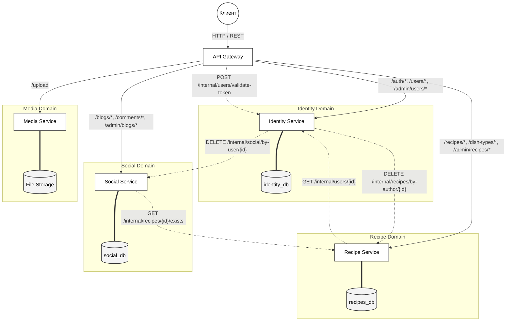
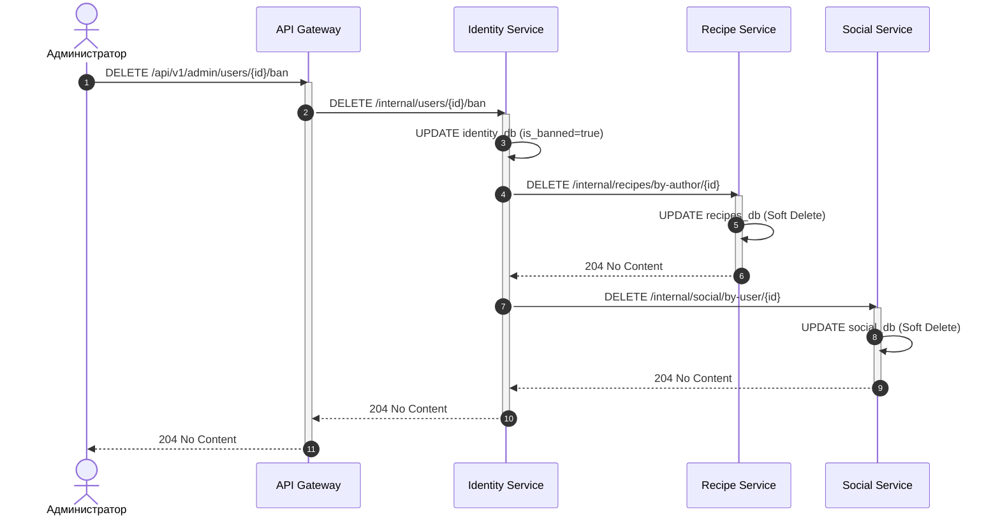

# Технический дизайн-документ (SDD): Микросервисная архитектура кулинарной платформы

**Проект:** Бэкенд-система сервиса для обмена рецептами и кулинарных блогов

**Архитектурный шаблон:** Microservices / Database-per-Service / API Gateway

**Интеграционный протокол:** Synchronous REST API (HTTP/1.1)

Настоящий документ является архитектурным паспортом системы. Он регламентирует процесс миграции от монолитной базы (Node.js/TypeORM) к распределенной микросервисной инфраструктуре, фиксирует доменные границы, стратегии изоляции данных, протоколы безопасности и алгоритмы межсервисной коммуникации.

## 1. Декомпозиция монолита и границы доменов

Анализ монолитного приложения выявил критические узлы: смешивание тяжелых файловых операций, социальной активности и логики авторизации в едином процессе ограничивает возможности масштабирования.

Система декомпозирована на инфраструктурный шлюз и четыре независимых домена (Bounded Contexts) на основе методологии DDD.

### 1.1. Спецификация микросервисов

| Компонент / Сервис   | Порт | Зона ответственности и бизнес-логика                                                                                                                                           |
| :------------------- | :--- | :----------------------------------------------------------------------------------------------------------------------------------------------------------------------------- |
| **API Gateway**      | 8000 | **Infrastructure Facade.** Маршрутизация трафика (Reverse Proxy), терминация SSL, централизованная проверка JWT-токенов (authMiddleware). Скрывает внутреннюю сеть от клиента. |
| **Identity Service** | 8001 | **IAM (Identity & Access Management).** Критический узел. Регистрация, хэширование паролей, управление профилями, проверка прав (RBAC) и система блокировок.                   |
| **Recipe Service**   | 8002 | **Core Content.** Жизненный цикл рецептов, транзакционное сохранение пошаговых инструкций и ингредиентов, управление справочниками и личными закладками.                       |
| **Social Service**   | 8003 | **Social Graph.** Управление кулинарными блогами, полиморфными комментариями, лайками и социальным графом (подписками).                                                        |
| **Media Service**    | 8004 | **File I/O.** Изолированная обработка multipart/form-data. Загрузка изображений на диск и отдача статических URL, что защищает бизнес-сервисы от блокировки Event Loop.        |

### 1.2. Структурная топология системы

Внешние клиенты взаимодействуют исключительно со шлюзом. Внутренние сервисы скрыты в приватной сети (Docker bridge) и монопольно владеют своими хранилищами.

_Рисунок 1 – Архитектура распределения трафика и паттерн Database-per-Service._

## 2. Архитектурные решения (ADR) и Изоляция данных

Переход к распределенной архитектуре требует устранения единой СУБД (PostgreSQL). Ниже приведены ключевые архитектурные решения (Architecture Decision Records) по разделению данных.

### ADR 1: Перенос социального графа в Social Service

- **Контекст:** В монолитной архитектуре подписками (subscriptions) управлял UserController, поэтому исторически они находились рядом с пользователями.
- **Проблема:** В микросервисах подписка – это связь (Edge) социального графа. Чтение подписок происходит постоянно при формировании лент новостей. Хранение подписок в Identity Service перегрузило бы критический сервис авторизации "мусорными" социальными запросами.
- **Решение:** Таблица subscriptions изъята из домена Identity и перенесена в **social_db**. Identity теперь отвечает исключительно за аутентификацию.

### ADR 2: Локальность данных для личных закладок

- **Контекст:** Закладки (saved_recipes) связывают пользователя и рецепт.
- **Решение:** Таблица оставлена в **recipes_db**. Это позволяет Recipe Service выполнять один локальный SQL-запрос (через JOIN) для формирования страницы "Мои закладки", исключая необходимость гонять массивы из тысяч ID рецептов по сети.

### 2.1. Итоговая изоляция схем хранения

- **identity_db**: users (профили, хэши паролей, роли).
- **recipes_db**: recipes, recipe_steps, ingredients, dish_types, recipe_ingredients, recipe_dish_types, saved_recipes.
- **social_db**: blog_posts, comments, likes, subscriptions.
- **media_db**: Файловая система (Docker Volume) + таблица метаданных файлов.

### 2.2. Замещение физической ссылочной целостности

Ограничения SQL FOREIGN KEY между базами невозможны.

1. Все междоменные внешние ключи (например, author_id в таблице recipes или recipe_id в таблице likes) преобразуются в столбцы типа UUID.
2. БД больше не контролирует связи. Целостность гарантируется программно: перед созданием связи сервис обязан выполнить HTTP-запрос для проверки существования целевого объекта.

## 3. Реестр межсервисных контрактов (Internal API)

Для программного обеспечения ссылочной целостности и обмена данными спроектирован закрытый контур REST API (роуты /internal/...).

### Таблица 1 – Реестр внутренних контрактов и Fallback-стратегии

| Инициатор           | Целевая система | Эндпоинт и метод            | Бизнес-сценарий                                                                                                  | Поведение при сбое (Fallback)                          |
| :------------------ | :-------------- | :-------------------------- | :--------------------------------------------------------------------------------------------------------------- | :----------------------------------------------------- |
| **Gateway**         | Identity        | POST /auth/validate         | **Безопасность.** Шлюз просит Identity проверить подпись JWT и вернуть роль пользователя.                        | Отказ в доступе клиенту (401 Unauthorized).            |
| **Social**          | Identity        | GET /users/{id}/exists      | **Валидация.** Social проверяет, жив ли пользователь, перед тем как разрешить подписаться на него.               | Блокировка операции создания (400 Bad Request).        |
| **Social**          | Recipe          | GET /recipes/{id}/exists    | **Валидация.** Social проверяет, существует ли рецепт, перед сохранением лайка или комментария.                  | Блокировка операции создания (400 Bad Request).        |
| **Recipe / Social** | Identity        | POST /users/bulk            | **Агрегация (N+1).** Массовый запрос профилей (аватарок и имен) для массива author_id при выдаче списков постов. | Возврат контента с заглушкой "Удаленный пользователь". |
| **Identity**        | Recipe          | DELETE /recipes/author/{id} | **Оркестрация.** Каскадное применение Soft Delete к рецептам при блокировке автора модератором.                  | Откат транзакции бана. Возврат ошибки администратору.  |
| **Identity**        | Social          | DELETE /social/user/{id}    | **Оркестрация.** Каскадная очистка подписок, лайков и постов при блокировке пользователя.                        | Откат транзакции бана. Возврат ошибки администратору.  |

## 4. Безопасность и Инфраструктура (API Gateway)

Архитектура безопасности базируется на паттерне **Gateway-to-Backend Security Flow (Zero Trust на периметре)**. Внутренние микросервисы изолированы от внешнего интернета и не занимаются криптографией.

1. **Терминация доступа:** API Gateway принимает внешний запрос (например, PATCH /api/v1/recipes/123).
2. **Делегирование авторизации:** Шлюз извлекает JWT из заголовка Authorization и синхронно валидирует его через Identity Service.
3. **Context Propagation (Проброс контекста):** При успехе шлюз инжектирует в HTTP-запрос доверенные заголовки X-User-Id и X-User-Role, после чего проксирует запрос в Recipe Service.
4. **Локальная бизнес-авторизация (RBAC):** Recipe Service доверяет заголовку X-User-Role (т.к. запрос пришел от шлюза) и выполняет локальную проверку: "Разрешить патч, если X-User-Id совпадает с author_id рецепта, ИЛИ X-User-Role === 'admin'".

## 5. Распределенные транзакции и Отказоустойчивость

### 5.1. Оркестрация каскадного удаления (Sequence Diagram)

В монолите удаление пользователя очищало связанные таблицы силами СУБД (ON DELETE CASCADE). В распределенной среде Identity Service берет на себя роль оркестратора.

Процесс (Рисунок 2):

1. Модератор отправляет команду DELETE /admin/users/{id}/ban.
2. Identity Service применяет локальный Soft Delete (устанавливает is_banned = true).
3. Отправляются синхронные HTTP-запросы DELETE /internal/... в Recipe Service и Social Service для деактивации контента.
4. Ожидаются статусы 204 No Content. Только при успешном ответе от обеих систем транзакция подтверждается.

_Рисунок 2 – Синхронная оркестрация процесса блокировки пользователя._

### 5.2. Политика Soft Delete и Медиафайлов

При блокировках и удалении контента используется паттерн мягкого удаления (декоратор @DeleteDateColumn()).

В связи с этим **категорически запрещено** инициировать запросы на удаление в Media Service. Физические фотографии (аватары, шаги рецептов) остаются на диске навсегда. Это бизнес-требование гарантирует, что в случае разблокировки (снятия бана) администратором, контент восстановится в первозданном виде без "битых" изображений.

### 5.3. Обсервабилити (Correlation ID)

Для отслеживания распределенных запросов API Gateway обязан генерировать уникальный заголовок X-Request-Id (Correlation ID) для каждого входящего запроса. Этот ID пробрасывается через все внутренние HTTP-вызовы, что позволяет объединить логи Identity, Recipe и Social сервисов в единую трассу при дебаггинге.

## 6. Пошаговый технический регламент миграции (ТЗ для разработчиков)

Для безопасного перевода монолитной кодовой базы на спроектированную архитектуру утверждается следующий план реализации (Implementation Plan):

**Шаг 1. Организация монорепозитория (Monorepo)**

- Создать директорию /services и выделить 5 независимых Node.js проектов (Gateway + 4 сервиса). Каждый сервис должен содержать свой package.json, tsconfig.json и src/app.ts.
- Выделить общий npm-пакет или директорию /shared-kernel для хранения общих DTO, Enums и TypeORM-интерфейсов, чтобы избежать рассинхронизации контрактов между сервисами.

**Шаг 2. Разрыв монолитного графа БД (TypeORM)**

- Физически разнести файлы .entity.ts по проектам согласно Разделу 2.1.
- В сущностях удалить реляционные декораторы @ManyToOne и @OneToMany, выходящие за пределы домена.
- Заменить их на примитивные колонки. _Пример:_ В recipe.entity.ts свойство author: User заменяется на @Column({ type: 'uuid' }) author_id: string.

**Шаг 3. Интеграция внутренних HTTP-клиентов**

- Установить библиотеку axios в сервисы для выполнения вызовов к internal эндпоинтам.
- **Настроить Circuit Breaker:** Для каждого вызова axios жестко задать параметр timeout: 3000 (3 секунды). Это предотвратит "зависание" вызывающего сервиса при отказе сети или падении соседнего узла.
- Реализовать эндпоинты агрегации (согласно Таблице 1) в контроллерах с префиксом /internal/.

**Шаг 4. Настройка инфраструктуры (Docker Compose)**

- Переписать docker-compose.yml: развернуть 4 изолированных инстанса (или 4 схемы) PostgreSQL с независимыми томами (volumes).
- Выделить микросервисам фиксированные порты (8001–8004) через файлы сред окружения .env.
- Объединить все сервисы в единую внутреннюю сеть docker network, чтобы они могли обращаться друг к другу по именам контейнеров (например, http://identity-service:8001).

**Шаг 5. Запуск инфраструктурного шлюза (API Gateway)**

- Создать проект на базе Express.js.
- Интегрировать библиотеку http-proxy-middleware для маршрутизации трафика (роутинг).
- Настроить authMiddleware на шлюзе: перед вызовом proxy() шлюз делает запрос к Identity Service на валидацию токена. В случае успеха – добавляет заголовки X-User-Id и X-User-Role в объект запроса и пропускает его в закрытую сеть.
