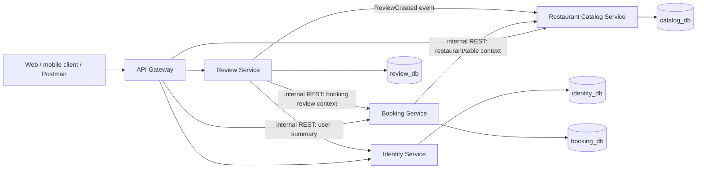

САНКТ-ПЕТЕРБУРГСКИЙ НАЦИОНАЛЬНЫЙ
ИССЛЕДОВАТЕЛЬСКИЙ УНИВЕРСИТЕТ ИТМО

Дисциплина: Бэк-энд разработка

Отчет

Домашнее задание 4

Технический дизайн микросервисной архитектуры

Выполнил:
Цатинян Артём
Группа БР1.2

Проверил:
Добряков Д. И.

Санкт-Петербург
2026 г.

## Задача

Тема проекта: приложение для бронирования столиков в ресторанах.

В рамках домашнего задания требовалось спроектировать переход от монолитного backend-приложения к микросервисной архитектуре. Необходимо разделить приложение на независимые сервисы по принципу `database-per-service`, описать взаимодействие между сервисами, спроектировать разделение существующей базы данных, подготовить OpenAPI-спецификацию для межсервисного взаимодействия, а также описать запросы, ответы, возможные ошибки и шаги миграции.

## Ход работы

Исходное приложение реализовано как монолитный REST API на Kotlin и Spring Boot. В одной базе данных находятся пользователи, рестораны, кухни, столики, меню, бронирования и отзывы. Такая структура удобна для первой реализации, но в монолите разные части предметной области связаны прямыми SQL-запросами и внешними ключами. При переходе к микросервисам эти связи нужно заменить на четкие контракты между сервисами.

Декомпозиция выполняется не по каждой таблице отдельно, а по самостоятельным бизнес-областям. Это позволяет не переусложнять архитектуру и при этом соблюсти принцип владения данными.

### Выделенные сервисы

| Сервис | Ответственность | Собственная БД |
| --- | --- | --- |
| API Gateway | Единая внешняя точка входа, маршрутизация публичных запросов, проверка JWT, прокидывание `userId` в downstream-сервисы | Нет |
| Identity Service | Регистрация, вход, хранение пользователей, ролей, паролей, профиля пользователя | `identity_db` |
| Restaurant Catalog Service | Каталог ресторанов, кухни, адреса, рабочие часы, столики, фотографии, меню, агрегированные рейтинги | `catalog_db` |
| Booking Service | Создание бронирований, отмена, просмотр бронирований, расчет доступности столиков | `booking_db` |
| Review Service | Создание и просмотр отзывов, проверка права пользователя оставить отзыв, события изменения рейтинга | `review_db` |

API Gateway не владеет бизнес-данными. Его задача - сохранить для клиента прежний внешний REST API и скрыть от клиента внутреннее разбиение системы.

### Архитектурная схема



Основной тип синхронного взаимодействия между сервисами - REST по внутренним эндпоинтам. Для обновления агрегированного рейтинга ресторана используется асинхронное событие `ReviewCreated`, потому что рейтинг не должен блокировать создание отзыва распределенной транзакцией.

### Маршрутизация внешнего API

Внешние пути можно оставить совместимыми с текущим API, чтобы клиентам не пришлось знать о внутренней декомпозиции.

| Внешний endpoint | Целевой сервис |
| --- | --- |
| `POST /api/v1/auth/register` | Identity Service |
| `POST /api/v1/auth/login` | Identity Service |
| `GET /api/v1/users/me`, `PATCH /api/v1/users/me` | Identity Service |
| `GET /api/v1/cuisines` | Restaurant Catalog Service |
| `GET /api/v1/restaurants` | Restaurant Catalog Service |
| `GET /api/v1/restaurants/{restaurantId}` | Restaurant Catalog Service |
| `GET /api/v1/restaurants/{restaurantId}/menu` | Restaurant Catalog Service |
| `GET /api/v1/restaurants/{restaurantId}/availability` | Booking Service |
| `POST /api/v1/bookings` | Booking Service |
| `GET /api/v1/bookings/me` | Booking Service |
| `GET /api/v1/bookings/{bookingId}` | Booking Service |
| `PATCH /api/v1/bookings/{bookingId}/cancel` | Booking Service |
| `GET /api/v1/restaurants/{restaurantId}/reviews` | Review Service |
| `POST /api/v1/restaurants/{restaurantId}/reviews` | Review Service |

Endpoint доступности столиков относится к Booking Service, потому что именно этот сервис владеет бронированиями и может корректно определить пересечения по времени. При этом Booking Service получает из Restaurant Catalog Service список активных столиков, вместимость и рабочие часы ресторана.

### Разделение базы данных

В микросервисной архитектуре сервисы не обращаются напрямую к чужим таблицам. Внешние ключи между разными бизнес-областями заменяются обычными идентификаторами и проверками через внутренние API.

#### `identity_db`

| Таблица | Назначение |
| --- | --- |
| `users` | Пользователи, email, хэш пароля, имя, фамилия, телефон, роль, активность, даты создания и обновления |

Identity Service является единственным владельцем учетных данных. Остальные сервисы хранят только `user_id` как внешний идентификатор и при необходимости получают краткую информацию о пользователе через internal API.

#### `catalog_db`

| Таблица | Назначение |
| --- | --- |
| `restaurants` | Основная информация о ресторанах, адрес, контакты, ценовой сегмент, политика бронирования |
| `cuisines` | Справочник кухонь |
| `restaurant_cuisines` | Связь ресторанов и кухонь |
| `restaurant_working_hours` | Рабочие часы ресторанов |
| `restaurant_tables` | Столики ресторанов и вместимость |
| `restaurant_photos` | Фотографии ресторанов |
| `menu_categories` | Категории меню |
| `menu_items` | Позиции меню |
| `restaurant_rating_stats` | Денормализованный read-model: средний рейтинг и количество отзывов |

Таблица `restaurant_rating_stats` нужна для сортировки и фильтрации ресторанов по рейтингу без синхронных запросов в Review Service на каждый поиск.

#### `booking_db`

| Таблица | Назначение |
| --- | --- |
| `bookings` | Бронирования пользователя: `user_id`, `restaurant_id`, `table_id`, статус, период, количество гостей, пожелания |

В `bookings` больше нет внешних ключей на `users`, `restaurants` и `restaurant_tables`, потому что эти таблицы принадлежат другим сервисам. Для удобства отображения можно добавить snapshot-поля: `restaurant_name_snapshot`, `table_number_snapshot`, `table_seats_snapshot`. Они фиксируют состояние на момент создания бронирования и позволяют отдавать список бронирований без лишних синхронных вызовов.

#### `review_db`

| Таблица | Назначение |
| --- | --- |
| `reviews` | Отзывы: `booking_id`, `restaurant_id`, `user_id`, оценка, комментарий, snapshot имени автора |
| `review_outbox` | Очередь исходящих событий для надежной доставки `ReviewCreated` |

В `reviews.booking_id` сохраняется уникальное ограничение внутри `review_db`, чтобы по одному бронированию нельзя было оставить два отзыва. Проверка того, что бронирование действительно принадлежит пользователю и завершено, выполняется через Booking Service.

### Замена связей монолита

| Связь в монолите | Решение после декомпозиции |
| --- | --- |
| `bookings.user_id -> users.id` | `booking_db.bookings.user_id` хранится как scalar id, пользователь проверяется через JWT и при необходимости через Identity Service |
| `bookings.restaurant_id -> restaurants.id` | Booking Service вызывает Restaurant Catalog Service перед созданием бронирования |
| `bookings.table_id -> restaurant_tables.id` | Booking Service получает table context из Restaurant Catalog Service и проверяет вместимость |
| `reviews.booking_id -> bookings.id` | Review Service вызывает Booking Service, чтобы проверить завершенное бронирование |
| `reviews.user_id -> users.id` | Review Service получает имя автора из JWT или Identity Service и хранит snapshot |
| `restaurants` joins `reviews` для рейтинга | Catalog Service читает локальную таблицу `restaurant_rating_stats`, обновляемую событием из Review Service |
| `restaurant_tables` joins `bookings` для availability | Booking Service считает доступность по своей БД бронирований и данным о столиках из Catalog Service |

### Межсервисное взаимодействие

OpenAPI-спецификация внутренних REST-контрактов вынесена в файл:

`homeworks/hw4/interservice-openapi.yaml`

В спецификации описаны следующие группы внутренних endpoint-ов:

| Endpoint | Кто вызывает | Назначение |
| --- | --- | --- |
| `GET /identity/internal/v1/auth/jwks` | API Gateway и сервисы | Получение публичных ключей для проверки JWT |
| `GET /identity/internal/v1/users/{userId}/summary` | Review Service, Booking Service | Получение краткого профиля пользователя |
| `GET /catalog/internal/v1/restaurants/{restaurantId}/summary` | Booking Service, Review Service | Получение краткой информации о ресторане |
| `GET /catalog/internal/v1/restaurants/{restaurantId}/booking-context` | Booking Service | Проверка ресторана, столика, вместимости и рабочих часов перед созданием бронирования |
| `GET /catalog/internal/v1/restaurants/{restaurantId}/availability-context` | Booking Service | Получение активных столиков и рабочих часов для расчета доступности |
| `POST /booking/internal/v1/bookings/availability/check` | Restaurant Catalog Service или API Gateway | Проверка занятости набора столиков на интервал времени |
| `GET /booking/internal/v1/bookings/{bookingId}/review-context` | Review Service | Проверка права пользователя оставить отзыв |
| `GET /reviews/internal/v1/restaurants/{restaurantId}/rating-stats` | Restaurant Catalog Service | Синхронизация рейтингов при пересчете или восстановлении read-model |

Для внутренних запросов используется отдельная сервисная авторизация, например заголовок `X-Service-Token`. Пользовательский JWT не должен использоваться как единственный механизм доверия между сервисами.

Асинхронное событие `ReviewCreated` передается из Review Service в Catalog Service после создания отзыва. Минимальный payload события:

```json
{
  "eventId": "9d15a4f0-4c47-4d68-b79a-6bb0d1e2a111",
  "eventType": "ReviewCreated",
  "occurredAt": "2026-05-12T12:00:00Z",
  "reviewId": 101,
  "restaurantId": 1,
  "userId": 3,
  "rating": 5
}
```

Catalog Service использует событие для пересчета `restaurant_rating_stats`. Повторная доставка события должна быть безопасной: для этого можно хранить обработанные `eventId` или пересчитывать агрегат по данным Review Service через internal endpoint.

### Основные сценарии взаимодействия

#### Создание бронирования

1. Клиент отправляет `POST /api/v1/bookings` в API Gateway.
2. Gateway проверяет JWT и передает запрос в Booking Service вместе с `userId`.
3. Booking Service вызывает `GET /catalog/internal/v1/restaurants/{restaurantId}/booking-context`.
4. Catalog Service проверяет, что ресторан и столик активны, столик принадлежит ресторану, вместимость подходит, а интервал попадает в рабочие часы.
5. Booking Service проверяет в `booking_db`, что у выбранного столика нет пересекающегося активного бронирования.
6. Booking Service создает запись в `bookings` и сохраняет snapshot ресторана и столика.
7. Клиент получает созданное бронирование.

Возможные ошибки: `401` при отсутствии JWT, `404` если ресторан или столик не найдены, `422` если столик не подходит по вместимости или времени работы, `409` если столик уже забронирован на выбранное время.

#### Получение доступности ресторана

1. Клиент отправляет `GET /api/v1/restaurants/{restaurantId}/availability`.
2. Gateway маршрутизирует запрос в Booking Service.
3. Booking Service получает из Catalog Service рабочие часы и активные столики.
4. Booking Service проверяет пересечения с бронированиями в своей БД.
5. Клиент получает список свободных слотов.

Такой подход сохраняет единственного владельца данных о бронированиях и убирает прямой SQL join между `restaurant_tables` и `bookings`.

#### Создание отзыва

1. Клиент отправляет `POST /api/v1/restaurants/{restaurantId}/reviews`.
2. Gateway проверяет JWT и передает запрос в Review Service.
3. Review Service вызывает `GET /booking/internal/v1/bookings/{bookingId}/review-context`.
4. Booking Service проверяет, что бронирование принадлежит пользователю, относится к выбранному ресторану, завершено и уже прошло по времени.
5. Review Service проверяет уникальность `booking_id` в своей БД.
6. Review Service создает отзыв и записывает событие `ReviewCreated` в `review_outbox`.
7. Catalog Service получает событие и обновляет `restaurant_rating_stats`.

Возможные ошибки: `404` если бронирование не найдено или не принадлежит пользователю, `400` если оценка вне диапазона, `409` если отзыв по бронированию уже существует, `422` если бронирование еще не завершено.

#### Поиск ресторанов с сортировкой по рейтингу

1. Клиент отправляет `GET /api/v1/restaurants` с фильтрами, сортировкой и пагинацией.
2. Gateway маршрутизирует запрос в Restaurant Catalog Service.
3. Catalog Service фильтрует рестораны по своим таблицам и использует локальную таблицу `restaurant_rating_stats`.
4. Если read-model нужно восстановить, Catalog Service может запросить `GET /reviews/internal/v1/restaurants/{restaurantId}/rating-stats`.

Поиск не должен делать синхронный запрос в Review Service для каждого ресторана из страницы, иначе пагинация и сортировка станут нестабильными и медленными.

### Общий формат ошибок

Для публичных и внутренних endpoint-ов используется единый формат ошибки:

```json
{
  "timestamp": "2026-05-12T12:00:00Z",
  "status": 409,
  "error": "Conflict",
  "message": "This table is already booked for the selected time range",
  "path": "/api/v1/bookings",
  "details": []
}
```

Основные коды:

| Код | Когда возвращается |
| --- | --- |
| `400 Bad Request` | Ошибка формата запроса или валидации DTO |
| `401 Unauthorized` | Нет JWT или service token |
| `403 Forbidden` | Пользователь или сервис не имеет прав |
| `404 Not Found` | Сущность не найдена или недоступна вызывающей стороне |
| `409 Conflict` | Конфликт текущего состояния: занятый столик, повторный отзыв |
| `422 Unprocessable Entity` | Запрос синтаксически корректен, но нарушает бизнес-правило |
| `503 Service Unavailable` | Зависимый сервис временно недоступен |

### План миграции монолита

1. Зафиксировать текущий внешний REST API из ДЗ2 и ЛР1 как контракт, который должен сохранить API Gateway.
2. Вынести Identity Service: перенести таблицу `users`, регистрацию, логин, профиль пользователя и выпуск JWT.
3. Перевести JWT на схему, удобную для микросервисов: Identity Service выпускает токены, Gateway и сервисы проверяют подпись по публичному ключу или по общему internal contract.
4. Вынести Restaurant Catalog Service: перенести таблицы ресторанов, кухонь, столиков, меню, фото и рабочих часов.
5. Добавить в Catalog Service internal endpoint-ы для получения restaurant/table context, чтобы Booking Service не обращался к чужой БД.
6. Вынести Booking Service: перенести `bookings`, убрать внешние ключи на чужие таблицы, добавить snapshot-поля для отображения бронирований.
7. Перенести endpoint availability в Booking Service, потому что расчет зависит от бронирований.
8. Вынести Review Service: перенести `reviews`, убрать внешние ключи на `bookings`, `users`, `restaurants`, оставить scalar id и unique constraint на `booking_id`.
9. Добавить проверку права на отзыв через internal endpoint Booking Service.
10. Добавить outbox в Review Service и обработчик события `ReviewCreated` в Catalog Service для обновления `restaurant_rating_stats`.
11. Подготовить отдельные Liquibase changelog-и для каждой БД.
12. Перенести данные из монолитной схемы `storage` в новые базы: `identity_db`, `catalog_db`, `booking_db`, `review_db`.
13. Выполнить regression smoke-test по Postman-сценарию из ДЗ3: login, users/me, cuisines, restaurant search, details, menu, availability, create booking, my bookings, cancel booking, reviews.
14. После стабилизации выключить прямые обращения монолита к старой общей БД.

### Требования к надежности

Распределенные транзакции между сервисами не используются. Если операция затрагивает несколько сервисов, владелец основной бизнес-операции сохраняет свое состояние локально, а дополнительные изменения выполняются через события или повторяемые internal API.

Для событий используется outbox-подход: Review Service сначала сохраняет отзыв и событие в одной локальной транзакции, затем отдельный publisher отправляет событие в брокер. Catalog Service должен обрабатывать событие идемпотентно, чтобы повторная доставка не ломала статистику рейтинга.

Для диагностики каждый входящий запрос получает correlation id. Gateway передает его во все downstream-сервисы, а сервисы пишут его в логи.

## Вывод

В результате был подготовлен технический дизайн микросервисной архитектуры для приложения бронирования столиков в ресторанах. Монолит разделен на четыре предметных сервиса и API Gateway. Для каждого сервиса определены зона ответственности и собственная база данных. Прямые связи между таблицами заменены внутренними REST-контрактами и асинхронным событием обновления рейтинга. Также подготовлена OpenAPI-спецификация межсервисных endpoint-ов и описан пошаговый план миграции от текущего монолита к архитектуре `database-per-service`.
